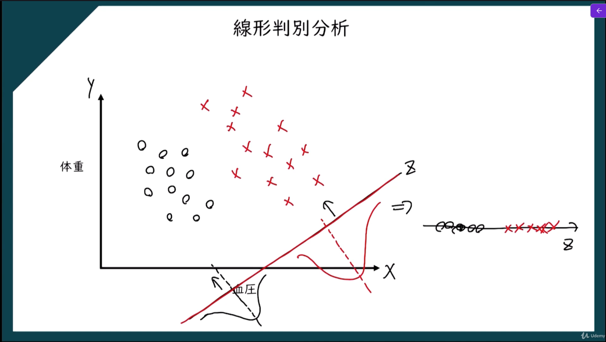

次元削減とは、**たくさんの特徴量を持つデータを、できるだけ重要な情報を保ちながら少ない次元にまとめること**です。
たとえば、あるデータが
- 身長
- 体重
- 年齢
- 売上
- 気温
- 単語数
- 画素値1〜1000

のように多くの項目を持っているとします。  
このような**次元（特徴量）が多いデータを、もっと少ない特徴量で表現し直す**のが次元削減です。

## 「次元」とは何か

ここでいう次元とは、**データを表すための項目数**のことです。
例
- 身長と体重だけなら **2次元**
- 身長、体重、年齢なら **3次元**
- 画素が1000個ある画像データなら **1000次元**
機械学習では、特徴量が増えるほど計算が重くなったり、扱いにくくなったりします。

## なぜ次元削除が必要か

#### 1. 計算量を減らすため

特徴量が多いほど、学習や分析に時間がかかります。  
次元を減らせば、処理が軽くなります。

#### 2. ノイズや不要な情報を減らすため

すべての特徴量が重要とは限りません。  
関係の薄い特徴量を減らすことで、モデルの性能がよくなることがあります。

#### 3. 可視化しやすくするため

高次元データはそのままでは人が見て理解しにくいです。  
2次元や3次元に落とせば、グラフにして傾向を見やすくなります。

#### 4. 過学習を防ぎやすくするため

特徴量が多すぎると、訓練データに合わせすぎることがあります。  
次元削減で重要な情報だけに絞ると、汎化しやすくなる場合があります。

# 主成分分析

データには、互いに似た情報を持つ特徴量が含まれていることがあります。
たとえば、
- 身長
- 体重
のようなデータでは、ある程度関連がある項目もあります。  
このようなとき、元の特徴量をそのまま全部使わなくても、  **重要な情報をまとめた少数の新しい軸**で表せることがあります。
主成分分析は、そのために
- データのばらつきが大きい方向
- できるだけ情報をよく表す方向
を見つけて、新しい座標軸を作る方法です。


## 主成分分析の実装

```python
# 主成分分析
import numpy as np
import matplotlib.pyplot as plt
import pandas as pd
from sklearn.preprocessing import StandardScaler
from sklearn.decomposition import PCA
from sklearn.model_selection import train_test_split
from sklearn.linear_model import LogisticRegression
from sklearn.metrics import confusion_matrix, accuracy_score
from matplotlib.colors import ListedColormap

# 前処理
dataset = pd.read_csv('data/Wine.csv')
X = dataset.iloc[:, :-1].values
y = dataset.iloc[:, -1].values

# フィーチャースケーリング
sc = StandardScaler()
X = sc.fit_transform(X)

# データセットの分割
#  train_test_split関数は、データセットを訓練セットとテストセットに分割するための関数です。引数には、特徴量の配列、ターゲット変数の配列、テストセットの割合、および乱数シードが指定されます。
#  test_size=0.2は、データセットの20%をテストセットとして使用することを指定する引数です。これにより、訓練セットが80%になります。
#  random_state=0は、乱数シードを指定する引数です。これにより、データセットの分割が再現可能になります。同じ乱数シードを使用すると、同じ訓練セットとテストセットが生成されます。
X_train, X_test, y_train, y_test = train_test_split(X, y, test_size=0.2, random_state=0)

# PCAの適用
#  PCAクラスは、主成分分析を適用するためのクラスです。引数には、削減後の次元数が指定されます。
#  n_components=2は、削減後の次元数を指定する引数です。これにより、特徴量が2次元に削減されます。削減後の次元数は、データセットの分散を最大限に保持するために選択されます。
pca = PCA(n_components=2)
X_train = pca.fit_transform(X_train) # fit_transformメソッドは、PCAを適用して特徴量を削減するためのメソッドです。引数には、訓練セットの特徴量の配列が指定されます。これにより、訓練セットの特徴量が削減されます。
X_test = pca.transform(X_test) # transformメソッドは、PCAを適用して特徴量を削減するためのメソッドです。引数には、テストセットの特徴量の配列が指定されます。これにより、テストセットの特徴量が削減されます。

# ロジスティック回帰を使ったモデルの訓練
#  LogisticRegressionクラスは、ロジスティック回帰を使用してモデルを訓練するためのクラスです。引数には、乱数シードが指定されます。
#  random_state=0は、乱数シードを指定する引数です。これにより、モデルの訓練が再現可能になります。同じ乱数シードを使用すると、同じモデルが訓練されます。 ロジスティック回帰は、分類問題に使用される線形モデルであり、特徴量とターゲット変数の関係をモデル化します。
classifier = LogisticRegression(random_state=0)
classifier.fit(X_train, y_train)

# テスト用データセットによる結果の予測
y_pred = classifier.predict(X_test)

# 混同行列の作成
cm = confusion_matrix(y_test, y_pred)
print(cm)

# 正解率の計算
accuracy = accuracy_score(y_test, y_pred)
print("Accuracy:", accuracy)

# 訓練用データセットの可視化
X_set, y_set = X_train, y_train
# meshgrid関数は、2次元のグリッドを作成するための関数です。引数には、x軸とy軸の範囲が指定されます。これにより、特徴量空間全体をカバーするグリッドが作成されます。
X1, X2 = np.meshgrid(
    np.arange(start=X_set[:, 0].min() - 1, stop=X_set[:, 0].max() + 1, step=0.01)
    , np.arange(start=X_set[:, 1].min() - 1, stop=X_set[:, 1].max() + 1, step=0.01)
)

# contourf関数は、等高線を塗りつぶすための関数です。引数には、x座標、y座標、z座標、およびその他のオプションが指定されます。これにより、特徴量空間における分類境界が視覚化されます。
plt.contourf(X1, X2, classifier.predict(np.array([X1.ravel(), X2.ravel()]).T).reshape(X1.shape),alpha=0.75, cmap=ListedColormap(('red', 'green', 'blue')))

# scatter関数は、散布図を作成するための関数です。引数には、x座標、y座標、およびその他のオプションが指定されます。これにより、訓練セットのデータポイントが特徴量空間にプロットされます。
plt.xlim(X1.min(), X1.max())
plt.ylim(X2.min(), X2.max())

# enumerate関数は、イテラブルなオブジェクトを列挙するための関数です。引数には、イテラブルなオブジェクトが指定されます。これにより、クラスごとに異なる色でデータポイントがプロットされます。
for i, j in enumerate(np.unique(y_set)):
    plt.scatter(X_set[y_set == j, 0], X_set[y_set == j, 1], c=ListedColormap(('red', 'green', 'blue'))(i), label=j)

plt.title('Logistic Regression (Training set)')
plt.xlabel('PC1')
plt.ylabel('PC2')
plt.legend()
plt.show()
```


## 線形判別分析

たとえば、データに
- クラスA
- クラスB
があるとします。
このとき、ただ次元を減らすだけでなく、  **AとBができるだけ離れて見えるように変換したい**ことがあります。
線形判別分析は、
- **同じクラスのデータは近くなるように**
- **異なるクラスのデータは離れるように**
軸を見つける方法です。


## 主成分分析との違い

#### 主成分分析（PCA）
- データ全体の**ばらつきが大きい方向**を探す
- クラスラベルを使わない
- 次元削減が主目的
#### 線形判別分析（LDA）
- **クラスを分けやすい方向**を探す
- クラスラベルを使う
- 分類や判別を意識した次元削減

つまり、
- PCA は「情報をよく表す軸」
- LDA は「クラスをよく分ける軸」
を探します。

## 線形判別分析の実装

```python
# 線形判別分析
import numpy as np
import matplotlib.pyplot as plt
import pandas as pd
from sklearn.preprocessing import StandardScaler
from sklearn.discriminant_analysis import LinearDiscriminantAnalysis as LDA
from sklearn.model_selection import train_test_split
from sklearn.linear_model import LogisticRegression
from sklearn.metrics import confusion_matrix, accuracy_score
from matplotlib.colors import ListedColormap

# 前処理
dataset = pd.read_csv('data/Wine.csv')
X = dataset.iloc[:, :-1].values
y = dataset.iloc[:, -1].values

# フィーチャースケーリング
sc = StandardScaler()
X = sc.fit_transform(X)

# データセットの分割
#  train_test_split関数は、データセットを訓練セットとテストセットに分割するための関数です。引数には、特徴量の配列、ターゲット変数の配列、テストセットの割合、および乱数シードが指定されます。
#  test_size=0.2は、データセットの20%をテストセットとして使用することを指定する引数です。これにより、訓練セットが80%になります。
#  random_state=0は、乱数シードを指定する引数です。これにより、データセットの分割が再現可能になります。同じ乱数シードを使用すると、同じ訓練セットとテストセットが生成されます。
X_train, X_test, y_train, y_test = train_test_split(X, y, test_size=0.2, random_state=0)

# LDAの適用
#  LDAクラスは、線形判別分析を適用するためのクラスです。引数には、削減後の次元数が指定されます。
#  n_components=2は、削減後の次元数を指定する引数です。これにより、特徴量が2次元に削減されます。削減後の次元数は、データセットのクラス間の分散を最大限に保持するために選択されます。
lda = LDA(n_components=2)
X_train = lda.fit_transform(X_train, y_train) # fit_transformメソッドは、LDAを適用して特徴量を削減するためのメソッドです。引数には、訓練セットの特徴量の配列とターゲット変数の配列が指定されます。これにより、訓練セットの特徴量が削減されます。
X_test = lda.transform(X_test) # transformメソッドは、LDAを適用して特徴量を削減するためのメソッドです。引数には、テストセットの特徴量の配列が指定されます。これにより、テストセットの特徴量が削減されます。

# ロジスティック回帰を使ったモデルの訓練
#  LogisticRegressionクラスは、ロジスティック回帰を使用してモデルを訓練するためのクラスです。引数には、乱数シードが指定されます。
#  random_state=0は、乱数シードを指定する引数です。これにより、モデルの訓練が再現可能になります。同じ乱数シードを使用すると、同じモデルが訓練されます。 ロジスティック回帰は、分類問題に使用される線形モデルであり、特徴量とターゲット変数の関係をモデル化します。
classifier = LogisticRegression(random_state=0)
classifier.fit(X_train, y_train)

# テスト用データセットによる結果の予測
y_pred = classifier.predict(X_test)

# 混同行列の作成
cm = confusion_matrix(y_test, y_pred)
print(cm)

# 正解率の計算
accuracy = accuracy_score(y_test, y_pred)
print("Accuracy:", accuracy)

# 訓練用データセットの可視化
X_set, y_set = X_train, y_train
# meshgrid関数は、2次元のグリッドを作成するための関数です。引数には、x軸とy軸の範囲が指定されます。これにより、特徴量空間全体をカバーするグリッドが作成されます。
X1, X2 = np.meshgrid(
    np.arange(start=X_set[:, 0].min() - 1, stop=X_set[:, 0].max() + 1, step=0.01)
    , np.arange(start=X_set[:, 1].min() - 1, stop=X_set[:, 1].max() + 1, step=0.01)
)

# contourf関数は、等高線を塗りつぶすための関数です。引数には、x座標、y座標、z座標、およびその他のオプションが指定されます。これにより、特徴量空間における分類境界が視覚化されます。
plt.contourf(X1, X2, classifier.predict(np.array([X1.ravel(), X2.ravel()]).T).reshape(X1.shape),alpha=0.75, cmap=ListedColormap(('red', 'green', 'blue')))

# scatter関数は、散布図を作成するための関数です。引数には、x座標、y座標、およびその他のオプションが指定されます。これにより、訓練セットのデータポイントが特徴量空間にプロットされます。
plt.xlim(X1.min(), X1.max())
plt.ylim(X2.min(), X2.max())

# enumerate関数は、イテラブルなオブジェクトを列挙するための関数です。引数には、イテラブルなオブジェクトが指定されます。これにより、クラスごとに異なる色でデータポイントがプロットされます。
for i, j in enumerate(np.unique(y_set)):
    plt.scatter(X_set[y_set == j, 0], X_set[y_set == j, 1], c=ListedColormap(('red', 'green', 'blue'))(i), label=j)

plt.title('Logistic Regression (Training set)')
plt.xlabel('PC1')
plt.ylabel('PC2')
plt.legend()
plt.show()
```


## Kernel PCA

**非線形な構造を持つデータに対して使える主成分分析の拡張手法**です。
通常の主成分分析（PCA）は、**線形な関係**を前提にしてデータのばらつきが大きい方向を見つけます。  
しかし、実際のデータは曲がった形や複雑な形で分布していることがあります。  
Kernel PCA は、そのような**非線形なデータ構造も捉えられる**ようにした方法です。

## なぜKernel PCAが必要か

たとえば、2次元データが円形や半月形に分布しているとします。  
このようなデータでは、単純な直線では特徴をうまく捉えられません。
通常のPCAだと、
- データの広がりは見られる
- でも本当の構造は捉えにくい
ということがあります。
そこでKernel PCAでは、  **元のデータをより高次元の空間に写してから、その空間でPCAを行う**  という考え方を使います。
すると、元の空間では非線形でも、  写した先では線形に扱いやすくなることがあります。

