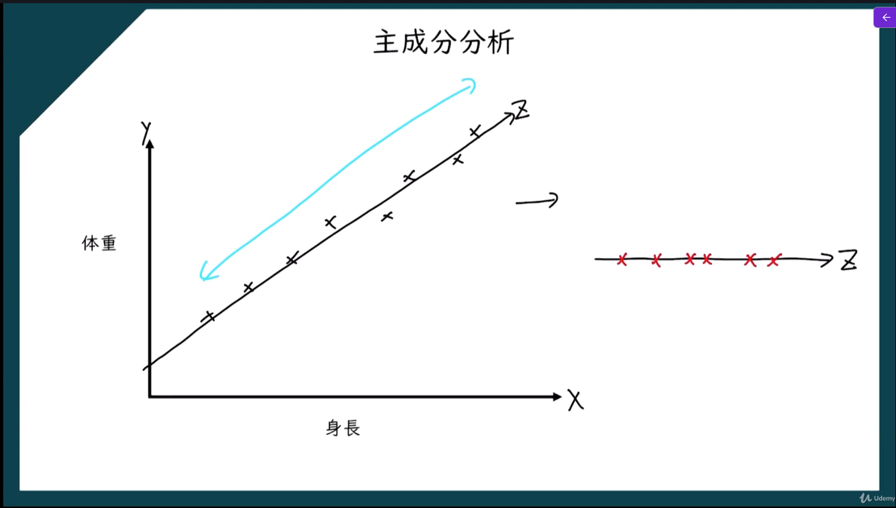

次元削減とは、**たくさんの特徴量を持つデータを、できるだけ重要な情報を保ちながら少ない次元にまとめること**です。
たとえば、あるデータが
- 身長
- 体重
- 年齢
- 売上
- 気温
- 単語数
- 画素値1〜1000

のように多くの項目を持っているとします。  
このような**次元（特徴量）が多いデータを、もっと少ない特徴量で表現し直す**のが次元削減です。

## 「次元」とは何か

ここでいう次元とは、**データを表すための項目数**のことです。
例
- 身長と体重だけなら **2次元**
- 身長、体重、年齢なら **3次元**
- 画素が1000個ある画像データなら **1000次元**
機械学習では、特徴量が増えるほど計算が重くなったり、扱いにくくなったりします。

## なぜ次元削除が必要か

#### 1. 計算量を減らすため

特徴量が多いほど、学習や分析に時間がかかります。  
次元を減らせば、処理が軽くなります。

#### 2. ノイズや不要な情報を減らすため

すべての特徴量が重要とは限りません。  
関係の薄い特徴量を減らすことで、モデルの性能がよくなることがあります。

#### 3. 可視化しやすくするため

高次元データはそのままでは人が見て理解しにくいです。  
2次元や3次元に落とせば、グラフにして傾向を見やすくなります。

#### 4. 過学習を防ぎやすくするため

特徴量が多すぎると、訓練データに合わせすぎることがあります。  
次元削減で重要な情報だけに絞ると、汎化しやすくなる場合があります。

# 主成分分析

データには、互いに似た情報を持つ特徴量が含まれていることがあります。
たとえば、
- 身長
- 体重
のようなデータでは、ある程度関連がある項目もあります。  
このようなとき、元の特徴量をそのまま全部使わなくても、  **重要な情報をまとめた少数の新しい軸**で表せることがあります。
主成分分析は、そのために
- データのばらつきが大きい方向
- できるだけ情報をよく表す方向
を見つけて、新しい座標軸を作る方法です。

