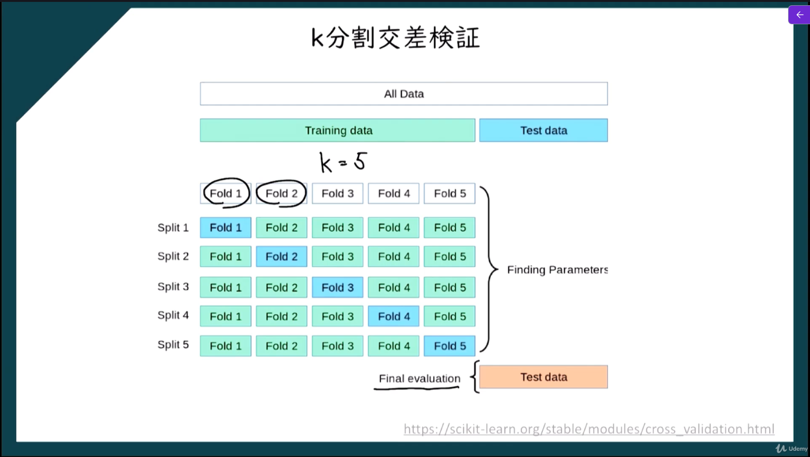

# k分割交差検証

**限られたデータを有効に使いながら、機械学習モデルの性能を評価する方法**。
普通は、データを
- 訓練データ
- テストデータ
に分けて学習と評価をします。
しかし、1回だけ分ける方法では、
- たまたま分け方が偏る
- 評価結果が安定しない
ことがあります。
そこで k分割交差検証では、  **データを k 個に分けて、学習と評価を何回か繰り返す**ことで、より信頼しやすい評価を行います。




## k分割交差検証の実装

```python
# k分割交差検証
import numpy as np
import matplotlib.pyplot as plt
import pandas as pd
from sklearn.preprocessing import StandardScaler
from sklearn.model_selection import train_test_split
from sklearn.svm import SVC
from sklearn.metrics import confusion_matrix
from sklearn.model_selection import cross_val_score
from matplotlib.colors import ListedColormap

# 前処理
dataset = pd.read_csv('data/Social_Network_Ads.csv')
X = dataset.iloc[:, :-1].values
y = dataset.iloc[:, -1].values

# フィーチャースケーリング
sc = StandardScaler()
X = sc.fit_transform(X)

# データセットの分割
#  train_test_split関数は、データセットを訓練セットとテストセットに分割するための関数です。引数には、特徴量の配列、ターゲット変数の配列、テストセットの割合、および乱数シードが指定されます。
#  test_size=0.25は、データセットの25%をテストセットとして使用することを指定する引数です。これにより、訓練セットが75%になります。
#  random_state=0は、乱数シードを指定する引数です。これにより、データセットの分割が再現可能になります。同じ乱数シードを使用すると、同じ訓練セットとテストセットが生成されます。
X_train, X_test, y_train, y_test = train_test_split(X, y, test_size=0.25, random_state=0)

# Kernel SVMモデルを使った訓練用データセットのモデル訓練
classifier = SVC(kernel = 'rbf', random_state = 0)
classifier.fit(X_train, y_train)

# テスト用データセットを使った結果の予測
y_pred = classifier.predict(X_test)

# 混同行列の作成
cm = confusion_matrix(y_test, y_pred)
print(cm)

# k分割交差検証の適用
# cross_val_score は、学習用データ (X_train, y_train) を 10 分割 (cv=10) し、
# そのうち 9 個を使って学習、残り 1 個を使って評価する処理を 10 回繰り返す
# 各回の評価結果（正解率）が accuracies に配列として格納される
accuracies = cross_val_score(estimator=classifier, X=X_train, y=y_train, cv=10)
print("Accuracy: {:.2f} %".format(accuracies.mean()*100))
print("Standard Deviation: {:.2f} %".format(accuracies.std()*100))

# 訓練用データセットの可視化
X_set, y_set = X_train, y_train
# meshgrid関数は、2次元のグリッドを作成するための関数です。引数には、x軸とy軸の範囲が指定されます。これにより、特徴量空間全体をカバーするグリッドが作成されます。
X1, X2 = np.meshgrid(
    np.arange(start=X_set[:, 0].min() - 1, stop=X_set[:, 0].max() + 1, step=0.01)
    , np.arange(start=X_set[:, 1].min() - 1, stop=X_set[:, 1].max() + 1, step=0.01)
)

# contourf関数は、等高線を塗りつぶすための関数です。引数には、x座標、y座標、z座標、およびその他のオプションが指定されます。これにより、特徴量空間における分類境界が視覚化されます。
plt.contourf(X1, X2, classifier.predict(np.array([X1.ravel(), X2.ravel()]).T).reshape(X1.shape),alpha=0.75, cmap=ListedColormap(('red', 'green')))

# scatter関数は、散布図を作成するための関数です。引数には、x座標、y座標、およびその他のオプションが指定されます。これにより、訓練セットのデータポイントが特徴量空間にプロットされます。
plt.xlim(X1.min(), X1.max())
plt.ylim(X2.min(), X2.max())

# enumerate関数は、イテラブルなオブジェクトを列挙するための関数です。引数には、イテラブルなオブジェクトが指定されます。これにより、クラスごとに異なる色でデータポイントがプロットされます。
for i, j in enumerate(np.unique(y_set)):
    plt.scatter(X_set[y_set == j, 0], X_set[y_set == j, 1], c=ListedColormap(('red', 'green'))(i), label=j)

plt.title('Kernel SVM（Training Salary）')
plt.xlabel('Age')
plt.ylabel('Estimated Salary')
plt.legend()
plt.show()
```


# grid search

機械学習モデルのハイパーパラメータを総当たりで試して、最も良い組み合わせを探す方法。
たとえば、SVM なら次のような調整項目があります。
- `C = 0.1, 1, 10`
- `kernel = linear, rbf`
- `gamma = 0.01, 0.1, 1`
このとき Grid Search は、これらの候補の**全組み合わせ**を試します。
- `(C=0.1, kernel=linear)`
- `(C=0.1, kernel=rbf, gamma=0.01)`
- `(C=0.1, kernel=rbf, gamma=0.1)`
- …
- `(C=10, kernel=rbf, gamma=1)`
そして、それぞれについて**交差検証**で性能を評価し、  **最も精度の高かった組み合わせ**を採用します。

## 何のために使うのか

機械学習モデルは、ハイパーパラメータによって性能が大きく変わります。  
ただし、最適な値は最初から分かりません。
そこで Grid Search を使うと、
- 人手で勘に頼らず
- 候補を漏れなく試して
- 最も良い設定を選べる
ようになります。

