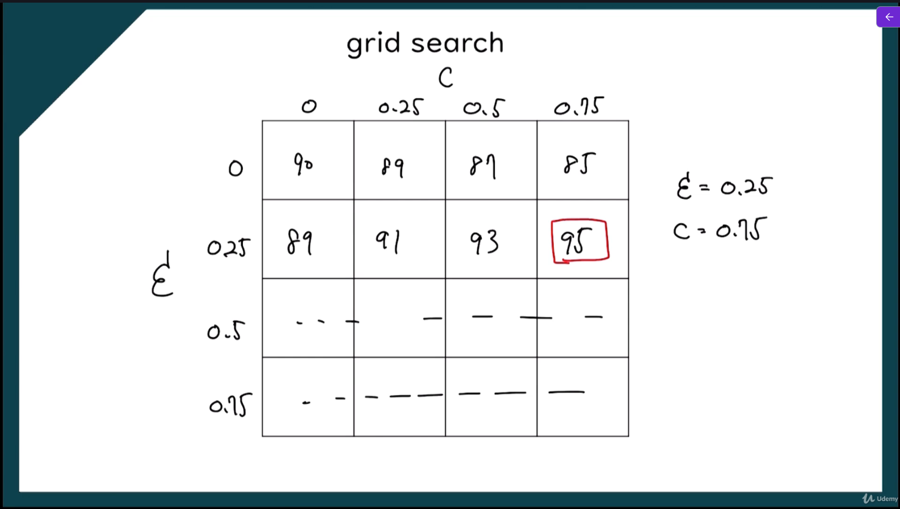
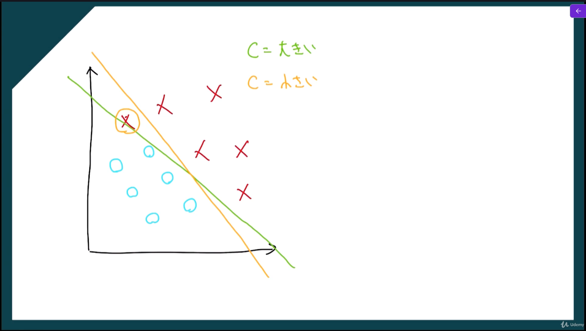
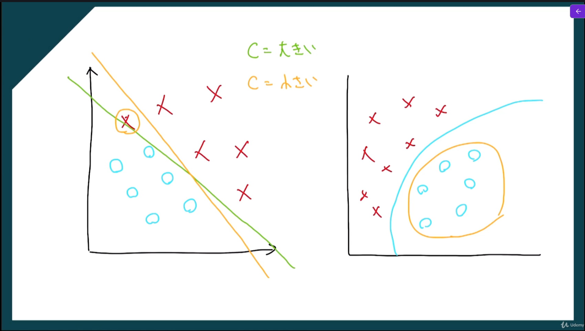

# k分割交差検証

**限られたデータを有効に使いながら、機械学習モデルの性能を評価する方法**。
普通は、データを
- 訓練データ
- テストデータ
に分けて学習と評価をします。
しかし、1回だけ分ける方法では、
- たまたま分け方が偏る
- 評価結果が安定しない
ことがあります。
そこで k分割交差検証では、  **データを k 個に分けて、学習と評価を何回か繰り返す**ことで、より信頼しやすい評価を行います。


## k分割交差検証の実装

```python
# k分割交差検証
import numpy as np
import matplotlib.pyplot as plt
import pandas as pd
from sklearn.preprocessing import StandardScaler
from sklearn.model_selection import train_test_split
from sklearn.svm import SVC
from sklearn.metrics import confusion_matrix
from sklearn.model_selection import cross_val_score
from matplotlib.colors import ListedColormap

# 前処理
dataset = pd.read_csv('data/Social_Network_Ads.csv')
X = dataset.iloc[:, :-1].values
y = dataset.iloc[:, -1].values

# フィーチャースケーリング
sc = StandardScaler()
X = sc.fit_transform(X)

# データセットの分割
#  train_test_split関数は、データセットを訓練セットとテストセットに分割するための関数です。引数には、特徴量の配列、ターゲット変数の配列、テストセットの割合、および乱数シードが指定されます。
#  test_size=0.25は、データセットの25%をテストセットとして使用することを指定する引数です。これにより、訓練セットが75%になります。
#  random_state=0は、乱数シードを指定する引数です。これにより、データセットの分割が再現可能になります。同じ乱数シードを使用すると、同じ訓練セットとテストセットが生成されます。
X_train, X_test, y_train, y_test = train_test_split(X, y, test_size=0.25, random_state=0)

# Kernel SVMモデルを使った訓練用データセットのモデル訓練
classifier = SVC(kernel = 'rbf', random_state = 0)
classifier.fit(X_train, y_train)

# テスト用データセットを使った結果の予測
y_pred = classifier.predict(X_test)

# 混同行列の作成
cm = confusion_matrix(y_test, y_pred)
print(cm)

# k分割交差検証の適用
# cross_val_score は、学習用データ (X_train, y_train) を 10 分割 (cv=10) し、
# そのうち 9 個を使って学習、残り 1 個を使って評価する処理を 10 回繰り返す
# 各回の評価結果（正解率）が accuracies に配列として格納される
accuracies = cross_val_score(estimator=classifier, X=X_train, y=y_train, cv=10)
print("Accuracy: {:.2f} %".format(accuracies.mean()*100))
print("Standard Deviation: {:.2f} %".format(accuracies.std()*100))

# 訓練用データセットの可視化
X_set, y_set = X_train, y_train
# meshgrid関数は、2次元のグリッドを作成するための関数です。引数には、x軸とy軸の範囲が指定されます。これにより、特徴量空間全体をカバーするグリッドが作成されます。
X1, X2 = np.meshgrid(
    np.arange(start=X_set[:, 0].min() - 1, stop=X_set[:, 0].max() + 1, step=0.01)
    , np.arange(start=X_set[:, 1].min() - 1, stop=X_set[:, 1].max() + 1, step=0.01)
)

# contourf関数は、等高線を塗りつぶすための関数です。引数には、x座標、y座標、z座標、およびその他のオプションが指定されます。これにより、特徴量空間における分類境界が視覚化されます。
plt.contourf(X1, X2, classifier.predict(np.array([X1.ravel(), X2.ravel()]).T).reshape(X1.shape),alpha=0.75, cmap=ListedColormap(('red', 'green')))

# scatter関数は、散布図を作成するための関数です。引数には、x座標、y座標、およびその他のオプションが指定されます。これにより、訓練セットのデータポイントが特徴量空間にプロットされます。
plt.xlim(X1.min(), X1.max())
plt.ylim(X2.min(), X2.max())

# enumerate関数は、イテラブルなオブジェクトを列挙するための関数です。引数には、イテラブルなオブジェクトが指定されます。これにより、クラスごとに異なる色でデータポイントがプロットされます。
for i, j in enumerate(np.unique(y_set)):
    plt.scatter(X_set[y_set == j, 0], X_set[y_set == j, 1], c=ListedColormap(('red', 'green'))(i), label=j)

plt.title('Kernel SVM（Training Salary）')
plt.xlabel('Age')
plt.ylabel('Estimated Salary')
plt.legend()
plt.show()
```


# grid search

機械学習モデルのハイパーパラメータを総当たりで試して、最も良い組み合わせを探す方法。
たとえば、SVM なら次のような調整項目があります。
- `C = 0.1, 1, 10`
- `kernel = linear, rbf`
- `gamma = 0.01, 0.1, 1`
このとき Grid Search は、これらの候補の**全組み合わせ**を試します。
- `(C=0.1, kernel=linear)`
- `(C=0.1, kernel=rbf, gamma=0.01)`
- `(C=0.1, kernel=rbf, gamma=0.1)`
- …
- `(C=10, kernel=rbf, gamma=1)`
そして、それぞれについて**交差検証**で性能を評価し、  **最も精度の高かった組み合わせ**を採用します。


## 何のために使うのか

機械学習モデルは、ハイパーパラメータによって性能が大きく変わります。  
ただし、最適な値は最初から分かりません。
そこで Grid Search を使うと、
- 人手で勘に頼らず
- 候補を漏れなく試して
- 最も良い設定を選べる
ようになります。

## grid searchの実装

```python
# Grid Search
import numpy as np
import matplotlib.pyplot as plt
import pandas as pd
from sklearn.preprocessing import StandardScaler
from sklearn.model_selection import train_test_split
from sklearn.svm import SVC
from sklearn.metrics import confusion_matrix
from sklearn.model_selection import cross_val_score
from matplotlib.colors import ListedColormap
from sklearn.model_selection import GridSearchSV

# 前処理
dataset = pd.read_csv('data/Social_Network_Ads.csv')
X = dataset.iloc[:, :-1].values
y = dataset.iloc[:, -1].values

# フィーチャースケーリング
sc = StandardScaler()
X = sc.fit_transform(X)

# データセットの分割
#  train_test_split関数は、データセットを訓練セットとテストセットに分割するための関数です。引数には、特徴量の配列、ターゲット変数の配列、テストセットの割合、および乱数シードが指定されます。
#  test_size=0.25は、データセットの25%をテストセットとして使用することを指定する引数です。これにより、訓練セットが75%になります。
#  random_state=0は、乱数シードを指定する引数です。これにより、データセットの分割が再現可能になります。同じ乱数シードを使用すると、同じ訓練セットとテストセットが生成されます。
X_train, X_test, y_train, y_test = train_test_split(X, y, test_size=0.25, random_state=0)

# Kernel SVMモデルを使った訓練用データセットのモデル訓練
classifier = SVC(kernel = 'rbf', random_state = 0)
classifier.fit(X_train, y_train)

# テスト用データセットを使った結果の予測
y_pred = classifier.predict(X_test)

# 混同行列の作成
cm = confusion_matrix(y_test, y_pred)
print(cm)

# k分割交差検証の適用
# cross_val_score は、学習用データ (X_train, y_train) を 10 分割 (cv=10) し、
# そのうち 9 個を使って学習、残り 1 個を使って評価する処理を 10 回繰り返す
# 各回の評価結果（正解率）が accuracies に配列として格納される
accuracies = cross_val_score(estimator=classifier, X=X_train, y=y_train, cv=10)
print("Accuracy: {:.2f} %".format(accuracies.mean()*100))
print("Standard Deviation: {:.2f} %".format(accuracies.std()*100))

# Grid Searchの適用
# Grid Search で試すハイパーパラメータの候補を定義
parameters = [
    # 線形カーネルを使う場合は、C の値だけを変えて試す
    {'C': [1, 10, 100, 1000], 'kernel': ['linear']},

    # RBFカーネルを使う場合は、C と gamma の組み合わせを変えて試す
    {'C': [1, 10, 100, 1000], 'kernel': ['rbf'], 'gamma': [0.1, 0.2, 0.3, 0.4, 0.5, 0.6, 0.7, 0.8, 0.9]}
]

# GridSearchCV を作成
# classifier を対象に、parameters で指定した全パラメータ候補を総当たりで評価する
grid_search = GridSearchSV(
    estimator=classifier,      # チューニング対象の学習モデル
    param_grid=parameters,     # 試すハイパーパラメータ候補
    scoring='accuracy',        # 評価指標として正解率を使用
    cv=10,                     # 10分割交差検証で性能を評価
    n_jobs=-1                  # 使用可能なCPUコアをすべて使って並列実行
)

# 学習データ X_train, y_train を使って Grid Search を実行
# 各パラメータの組み合わせごとに学習と評価を繰り返し、最も良い組み合わせを探す
grid_search = grid_search.fit(X_train, y_train)

# 最も高かった交差検証の平均正解率を取得
best_accuracy = grid_search.best_score_

# 最も良い結果となったハイパーパラメータの組み合わせを取得
best_parameters = grid_search.best_params_
print("Best Accuracy: {:.2f} %".format(best_accuracy*100))
print("Best Parameters: ", best_parameters)

# 訓練用データセットの可視化
X_set, y_set = X_train, y_train
# meshgrid関数は、2次元のグリッドを作成するための関数です。引数には、x軸とy軸の範囲が指定されます。これにより、特徴量空間全体をカバーするグリッドが作成されます。
X1, X2 = np.meshgrid(
    np.arange(start=X_set[:, 0].min() - 1, stop=X_set[:, 0].max() + 1, step=0.01)
    , np.arange(start=X_set[:, 1].min() - 1, stop=X_set[:, 1].max() + 1, step=0.01)
)

# contourf関数は、等高線を塗りつぶすための関数です。引数には、x座標、y座標、z座標、およびその他のオプションが指定されます。これにより、特徴量空間における分類境界が視覚化されます。
plt.contourf(X1, X2, classifier.predict(np.array([X1.ravel(), X2.ravel()]).T).reshape(X1.shape),alpha=0.75, cmap=ListedColormap(('red', 'green')))

# scatter関数は、散布図を作成するための関数です。引数には、x座標、y座標、およびその他のオプションが指定されます。これにより、訓練セットのデータポイントが特徴量空間にプロットされます。
plt.xlim(X1.min(), X1.max())
plt.ylim(X2.min(), X2.max())

# enumerate関数は、イテラブルなオブジェクトを列挙するための関数です。引数には、イテラブルなオブジェクトが指定されます。これにより、クラスごとに異なる色でデータポイントがプロットされます。
for i, j in enumerate(np.unique(y_set)):
    plt.scatter(X_set[y_set == j, 0], X_set[y_set == j, 1], c=ListedColormap(('red', 'green'))(i), label=j)

plt.title('Kernel SVM（Training Salary）')
plt.xlabel('Age')
plt.ylabel('Estimated Salary')
plt.legend()
plt.show()
```


# ハイパーパラメーターの補足

## C

**分類ミスに対するペナルティの強さ**です。
#### C が大きい場合
- 誤分類をできるだけ減らそうとする
- 学習データに強く合わせにいく
- 境界が複雑になりやすい
- **過学習しやすい**
#### C が小さい場合
- 多少の誤分類を許す
- 境界がなめらかになりやすい
- 汎化しやすいことがある
- **過学習しにくい**


## gamma

**1つの訓練データが周囲にどれくらい影響を与えるか**を決めます。  
これは特に **RBFカーネル** で重要です。
#### gamma が大きい場合
- 1つの点の影響範囲が狭い
- 細かい形に合わせやすい
- 境界が複雑になる
- **過学習しやすい**
#### gamma が小さい場合
- 1つの点の影響範囲が広い
- 全体をなめらかに捉える
- 境界が単純になりやすい
- **過学習しにくい**




# XG Boost

**決定木を1本ずつ追加しながら予測精度を高めていく勾配ブースティング系の機械学習手法**です。公式ドキュメントでは、XGBoostは「高速・高効率・柔軟」な gradient boosting ライブラリで、主に **parallel tree boosting** によって分類・回帰などの問題を解くと説明されています。
XGBoostは、最初から完璧なモデルを作るのではなく、  
**前の木が間違えた部分を、次の木が少しずつ補う**  
という流れで学習します。  
つまり、弱い決定木を何本も順番に作って、最終的に強いモデルにしていく方式です。これは boosted trees / gradient boosting の基本的な考え方です。

## 何が"Boost"なのか

通常の決定木は1本だけで予測しますが、XGBoostでは木を複数本使います。  
1本目で大まかに予測し、2本目でその誤差を補正し、3本目でさらに補正する…という形で、**誤差を減らす方向に逐次学習**していきます。XGBoostは Gradient Boosting framework の上に作られているため、この「前の誤りを次で直す」という発想が中心です。

## XG Boostの強み

XGBoostがよく使われる理由は、**精度が出やすい**だけでなく、**計算効率やスケーラビリティも重視して設計されている**ためです。公式文書や原論文では、並列化、分散実行、疎データへの対応、近似的な木学習、キャッシュ効率などが重視されており、大規模データでも扱いやすい設計になっています。

## XG Boostの使用用途

- **分類**：スパム判定、離職予測、病気判定
- **回帰**：価格予測、売上予測
- **ランキング**：検索結果や推薦順の最適化

## ランダムフォレストとの違い

ランダムフォレストは、たくさんの木を**独立に**作って多数決や平均を取ります。  
一方、XGBoostは木を**順番に**作り、前の木の失敗を次の木が補います。  
そのためXGBoostは、うまく調整すると高精度になりやすい一方で、ハイパーパラメータ調整の重要性が高いです。XGBoost公式でも、同じ木ベースでも random forest とは「学習アルゴリズムが異なる」と説明されています。

## 過学習しにくくする工夫

XGBoostは高性能ですが、そのままだと学習しすぎることがあります。  
そこで、**正則化**や**木の深さ制限**、**学習率**、**サブサンプリング**などで過学習を抑えます。原論文でも、XGBoostの特徴として正則化項を含む目的関数や効率的な木構築が説明されています。

## よく使うハイパーパラメーター

- `n_estimators`：木を何本作るか

- `max_depth`：各木の深さ
    
- `learning_rate`：1本ずつの補正の強さ
    
- `subsample`：学習に使うデータの割合
    
- `colsample_bytree`：各木で使う特徴量の割合
    
- `objective`：分類か回帰かなどの目的関数