> **似ているデータ同士を自動的にグループ（クラスタ）に分けること**

を行う機械学習手法（教師なし学習（Unsupervised Learning）の代表的な方法）。


# 分類とクラスタリングの違い

**分類（Classification）**と**クラスタリング（Clustering）**は、どちらもデータをグループ分けする機械学習の方法ですが、**学習方法と目的**が大きく異なる。

- **分類**：正解ラベル（教師データ）を使ってクラスを予測する
  ⇒最初から決まっているグループのいずれかに対象データを分類する。
- **クラスタリング**：ラベルなしで似ているデータを自動的にグループ化する
  ⇒グループ自体を発見する

# K平均法

**データをK個のグループ（クラスタ）に分けるクラスタリング手法**。
機械学習の **教師なし学習**の代表的なアルゴリズムです。
簡単に言うと

> **データをK個のグループに分け、同じグループ内のデータ同士ができるだけ似るようにする方法**

## K平均法の手順

1. クラスターの数（K）を選択する
2. セントロイドとして、ランダムにK個を選ぶ（データセットから選ぶ必要なし）
3. セントロイドからの近接性（距離）をもとに、クラスタリングを行う
4. クラスターの重心を新たなセントロイドとする
5. 3の手順に戻る。この時、あるデータが属するクラスターに変更がなければ、それでモデルの完成とする

## 例


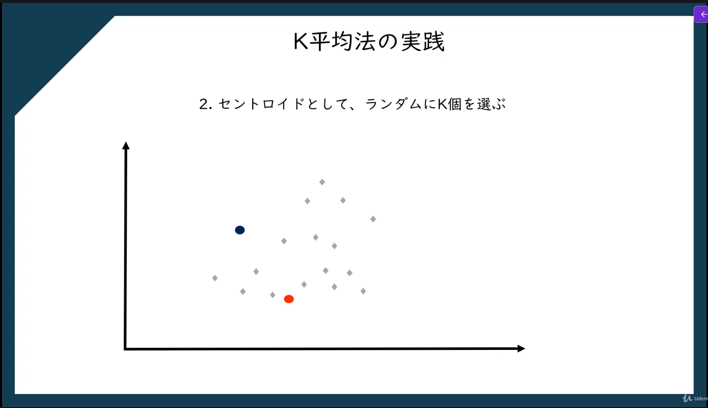

セントロイドからの距離を計算し、近い方に分類する

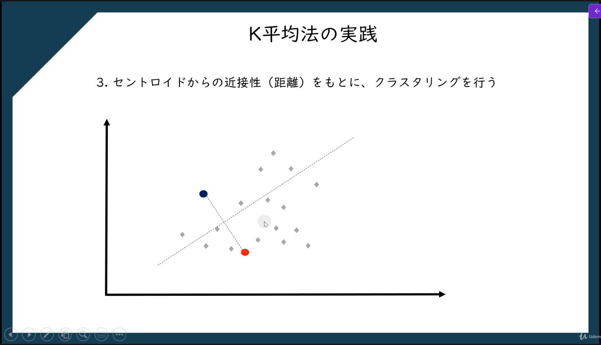
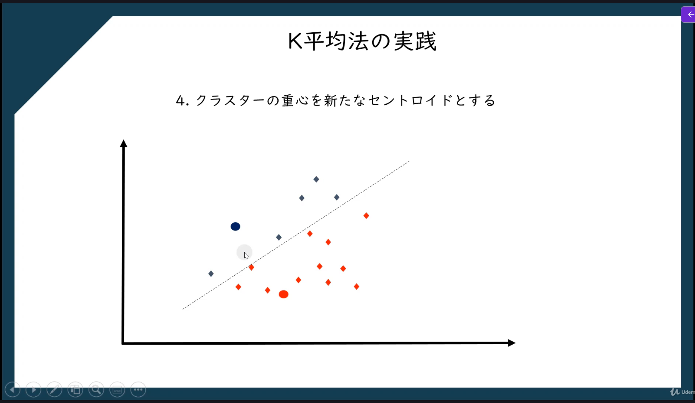

赤、青それぞれの重心を求めて、新しいセントロイドにする

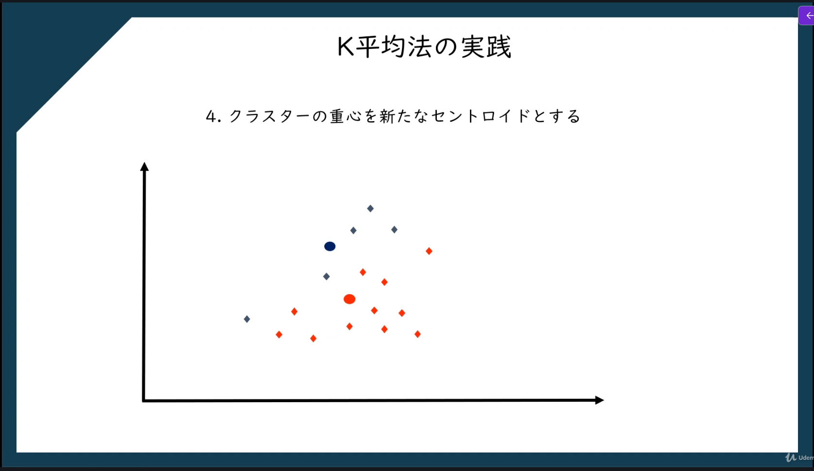

再度距離を計算し、分類を行う


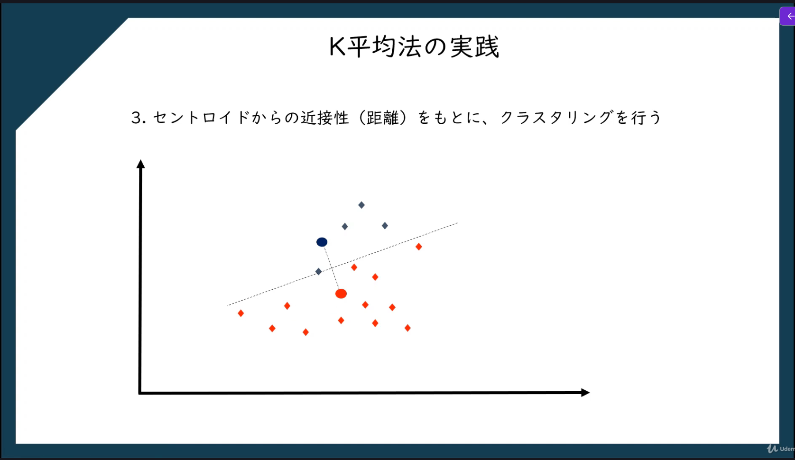

## Random initialization trap

**K平均法（K-means）などのアルゴリズムで、初期値をランダムに設定した結果、最適でない解（局所最適解）に収束してしまう問題**のこと。
簡単に言うと

> **最初のクラスタ中心の置き方が悪いと、正しくクラスタリングできない現象**

### 問題：セントロイドの設定に誤ると正しくクラスタリングできない

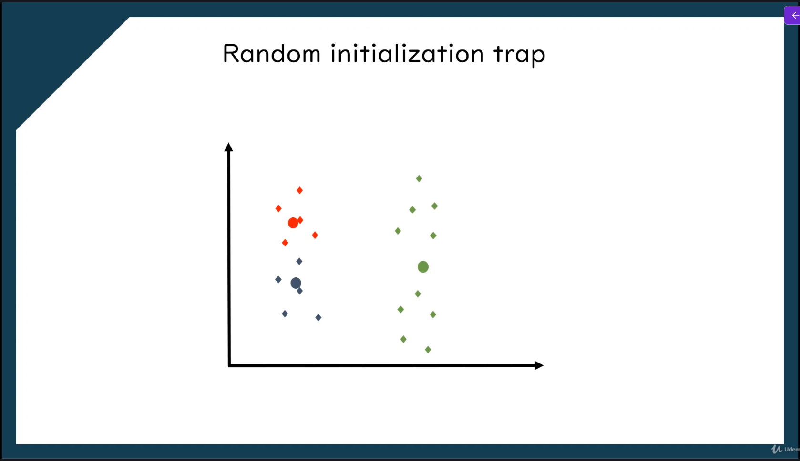

### 対策：K近傍法＋＋

## クラスターの数の決め方

### エルボー法

WCSS（Within Cluster Sum of Squares）が大きく減ったところのクラスターの数を採用する。
セントロイドからデータまでの距離の二乗を全データ分合計して算出する。

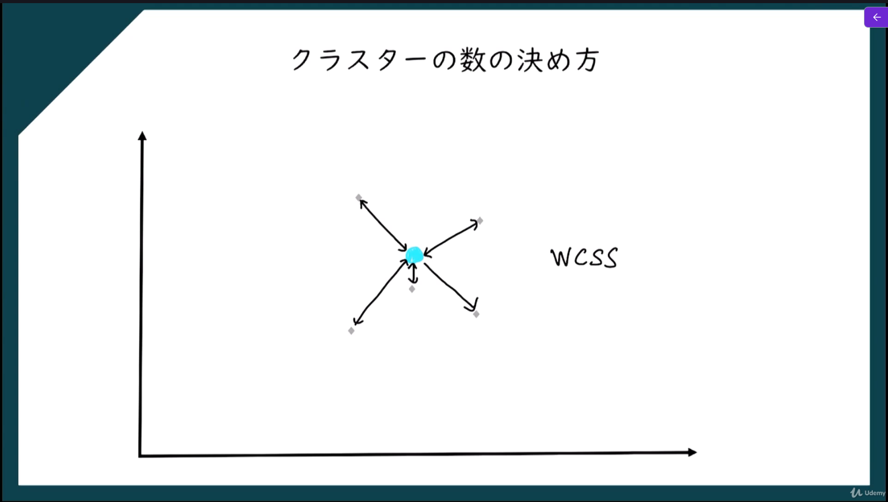

このWCSSの値が一番効率よく減る数をクラスターの数として採用する。

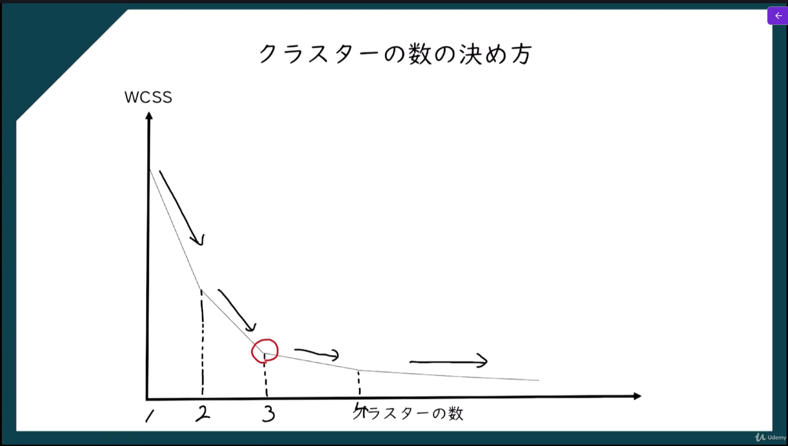

## K平均法の実装

```python
# K平均法（K-Means Clustering）
import numpy as np
import matplotlib.pyplot as plt
import pandas as pd
from sklearn.model_selection import train_test_split
from sklearn.linear_model import LinearRegression
from sklearn.compose import ColumnTransformer
from sklearn.preprocessing import OneHotEncoder
from sklearn.preprocessing import PolynomialFeatures
from sklearn.preprocessing import StandardScaler
from sklearn.svm import SVR
from sklearn.tree import DecisionTreeRegressor
from sklearn.ensemble import RandomForestRegressor
from sklearn.linear_model import LogisticRegression
from sklearn.metrics import r2_score
from sklearn.metrics import confusion_matrix, accuracy_score
from matplotlib.colors import ListedColormap
from sklearn.neighbors import KNeighborsClassifier
from sklearn.svm import SVC
from sklearn.naive_bayes import GaussianNB
from sklearn.tree import DecisionTreeClassifier
from sklearn.ensemble import RandomForestClassifier
from sklearn.cluster import KMeans

# 分析前の前処理
dataset = pd.read_csv('data/Mall_Customers.csv')
# iloc[:, [3, 4]]：データセットの全行と、3列目と4列目を選択（Age列とEstimatedSalary列）
# 教師なし学習のため、従属変数（Purchased列）は存在しないため、Xに独立変数のみを格納
X = dataset.iloc[:, [3, 4]].values  # 独立変数（Age列とEstimatedSalary列）

# エルボー法を使用して最適なクラスタ数を決定
wcss = [] # クラスタ内誤差平方和（Within-Cluster Sum of Squares）を格納するリスト
for i in range(1, 11): # クラスタ数を1から10まで変化させてループ
    # モデルの学習
    kmeans = KMeans(n_clusters = i, init = 'k-means++', random_state = 42) # KMeansクラスのインスタンスを作成（n_clustersはクラスタ数、initは初期化方法、random_stateは乱数シード（42は機械学習業界で一般的に使われる値））
    kmeans.fit(X) # KMeansモデルをデータXに適合させる
    wcss.append(kmeans.inertia_) # それぞれのクラスタ数における内誤差平方和（wcss）をリストに追加

# エルボー法のグラフを描画
plt.plot(range(1, 11), wcss) # クラスタ数とクラスタ内誤差平方和の関係をプロット
plt.title('The Elbow Method') # グラフのタイトルを設定
plt.xlabel('Number of clusters') # x軸のラベルを設定
plt.ylabel('WCSS') # y軸のラベルを設定
plt.show() # グラフを表示

# K平均法のモデルの学習
# n_clusters=5：クラスタ数を5に設定（上記で描画したグラフで最も効率が良かったクラスタ数を指定）
kmeans = KMeans(n_clusters = 5, init = 'k-means++', random_state = 42) # クラスタ数を5に設定してKMeansクラスのインスタンスを作成
y_kmeans = kmeans.fit_predict(X) # KMeansモデルをデータXに適合させ、各データポイントのクラスタ割り当てを予測してy_kmeansに格納

# クラスタの可視化
# クラスタ0を赤色、クラスタ1を青色、クラスタ2を緑色、クラスタ3をシアン色、クラスタ4をマゼンタ色でプロット
# y_kmeans == 0, 0はクラスタ0に属するデータポイントを選択し、X[y_kmeans == 0, 0]はそのデータポイントのx座標（Age列）を、X[y_kmeans == 0, 1]はそのデータポイントのy座標（EstimatedSalary列）を表す
plt.scatter(X[y_kmeans == 0, 0], X[y_kmeans == 0, 1], s = 100, c = 'red', label = 'Cluster 1') # クラスタ0のデータポイントを赤色でプロット
plt.scatter(X[y_kmeans == 1, 0], X[y_kmeans == 1, 1], s = 100, c = 'blue', label = 'Cluster 2') # クラスタ1のデータポイントを青色でプロット
plt.scatter(X[y_kmeans == 2, 0], X[y_kmeans == 2, 1], s = 100, c = 'green', label = 'Cluster 3') # クラスタ2のデータポイントを緑色でプロット
plt.scatter(X[y_kmeans == 3, 0], X[y_kmeans == 3, 1], s = 100, c = 'cyan', label = 'Cluster 4') # クラスタ3のデータポイントをシアン色でプロット
plt.scatter(X[y_kmeans == 4, 0], X[y_kmeans == 4, 1], s = 100, c = 'magenta', label = 'Cluster 5') # クラスタ4のデータポイントをマゼンタ色でプロット
plt.scatter(kmeans.cluster_centers_[:, 0], kmeans.cluster_centers_[:, 1], s = 300, c = 'yellow', label = 'Centroids') # クラスタの中心を黄色でプロット
plt.title('Clusters of customers') # グラフのタイトルを設定
plt.xlabel('Annual Income (k$)') # x軸のラベルを設定
plt.ylabel('Spending Score (1-100)') # y軸のラベルを設定
plt.legend() # 凡例を表示
plt.show() # グラフを表示
```


# 階層クラスタリング

**データ同士の距離や類似度をもとに、段階的（階層的）にクラスタを作っていくクラスタリング手法**。
特徴は

> **クラスタの階層構造（ツリー構造）を作る**

## 階層クラスタリングの種類

 - 凝集型クラスタリング（ボトムアップ）
 - 分割型クラスタリング（トップダウン）

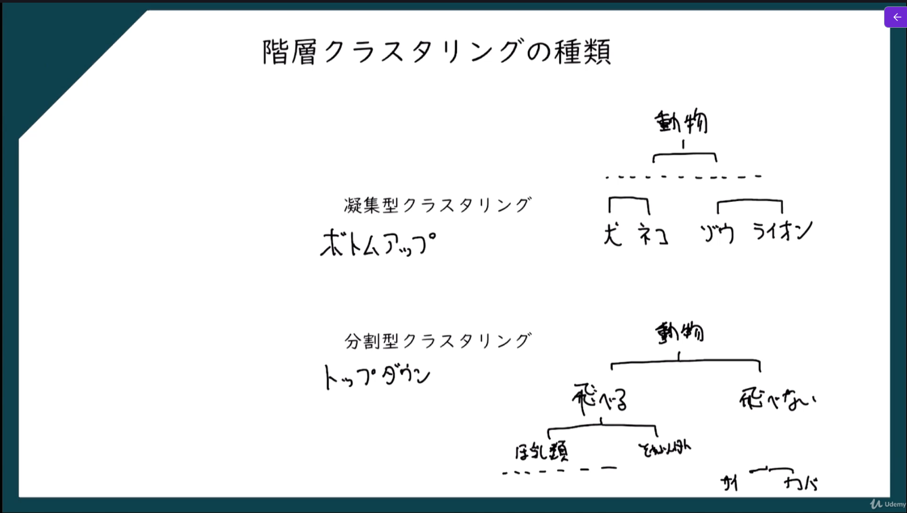

## 凝集型の手順

1. それぞれのデータをクラスターとする
   ⇒クラスターの数はN
2. 最も近接する２つのクラスターを１つのクラスターとする
   ⇒クラスターの数はN - 1
3. 最も近接する２つのクラスターを１つのクラスターとする
   ⇒クラスターの数はN - 2
4. クラスターの数が１つになるまで繰り返す

## クラスター間の距離の測り方

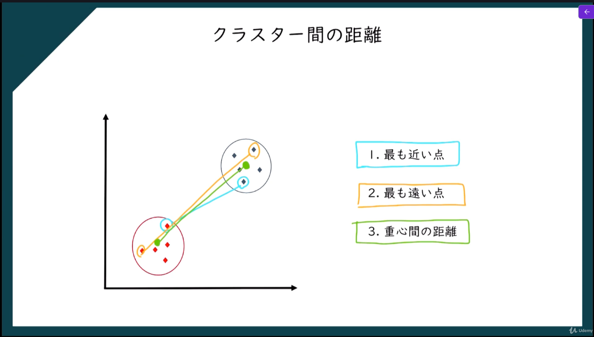

## 距離の計算方法（ユークリッド距離）

$$\sqrt{(X₂ - X₁)^2 + (y₂ - y₁)^2}$$

## 階層クラスタリングの実践

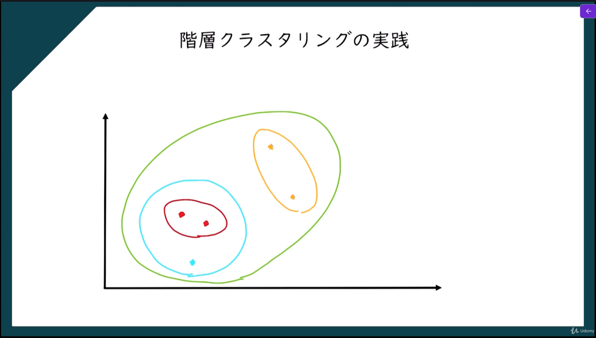
※凝集型の場合、赤⇒水色⇒橙色⇒緑の順にクラスタリング

## じゅけいず