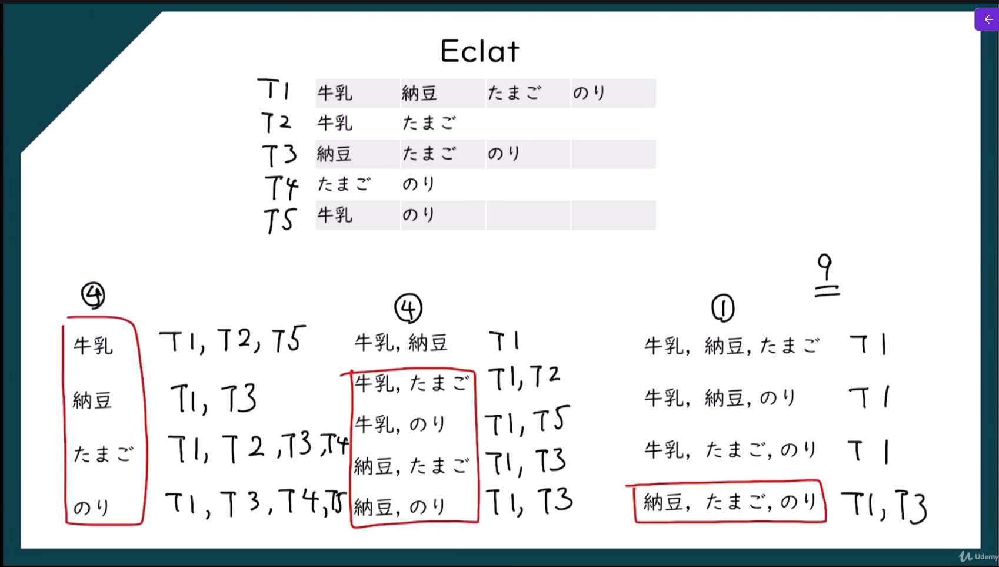

> **データの中から「一緒に起こりやすい事象の関係（ルール）」を発見するデータ分析手法**

特に **マーケットバスケット分析（Market Basket Analysis）**でよく使われる。

# Apriori

**相関ルール学習で「よく一緒に出現する商品（アイテム集合）」を見つけるためのアルゴリズム**。
特に **マーケットバスケット分析**で使われる。
簡単に言うと

> **頻繁に出現する商品の組み合わせ（頻出アイテム集合）を見つけるアルゴリズム**

## 指標

### 計算方法

$$support = \frac{牛乳を買った人の数}{すべてのデータ数}$$

$$confidence = \frac{たまごを勝った人の数}{牛乳を買った人の数}$$

$$lift = \frac{confideence}{support}$$
### support


### confidence・lift


## Aprioriの実装

```python
# Apriori
import pandas as pd
from apyori import apriori

# 分析前の前処理
dataset = pd.read_csv('data/Market_Basket_Optimisation.csv', header=None) # データセットを読み込む（header=Noneはデータセットにヘッダー行がないことを指定）
transaccions = []
for i in range(0, 7501):
    transaccions.append([str(dataset.values[i, j]) for j in range(0, 20)]) # データセットの各行をループして、各行の20列を文字列に変換してリストに格納し、transaccionsリストに追加する

# モデルの学習
#  apriori()：アプリオリアルゴリズムを実装する関数
#  transaccions：トランザクションデータのリストを指定
#  min_support=0.003：最小サポート値を0.003に設定（アイテムセットが全トランザクションの0.3%以上に出現する必要があることを指定）
#  min_confidence=0.2：最小信頼度を0.2に設定（ルールの信頼度が20%以上である必要があることを指定）
#  min_lift=3：最小リフト値を3に設定（ルールのリフト値が3以上である必要があることを指定）
#  min_length=2：最小アイテム数を2に設定（ルールに含まれるアイテムの数が2以上である必要があることを指定）
rules = apriori(transaccions, min_support = 0.003, min_confidence = 0.2, min_lift = 3, min_length = 2)

# 結果の表示1
results = list(rules)
print(results) # アプリオリアルゴリズムによって生成されたルールのリストを表示

# 結果の表示2
def inspect(results):
    lhs = [tuple(result[2][0][0])[0] for result in results] # ルールの左辺を抽出してリストに格納
    rhs = [tuple(result[2][0][1])[0] for result in results] # ルールの右辺を抽出してリストに格納
    supports = [result[1] for result in results] # ルールのサポート値を抽出してリストに格納
    confidences = [result[2][0][2] for result in results] # ルールの信頼度を抽出してリストに格納
    lifts = [result[2][0][3] for result in results] # ルールのリフト値を抽出してリストに格納
    return list(zip(lhs, rhs, supports, confidences, lifts)) # 左辺、右辺、サポート値、信頼度、リフト値をタプルとしてまとめたリストを返す

resultsinDataFrame = pd.DataFrame(inspect(results), columns = ['Left Hand Side', 'Right Hand Side', 'Support', 'Confidence', 'Lift']) # ルールの左辺、右辺、サポート値、信頼度、リフト値を列として持つデータフレームを作成
resultsinDataFrame = resultsinDataFrame.nlargest(n = 10, columns = 'Lift') # リフト値が最も高い上位10件のルールを抽出してデータフレームに格納

print(resultsinDataFrame) # データフレームを表示
```


# Eclat

**相関ルール学習で「頻出アイテム集合（Frequent Itemsets）」を見つけるアルゴリズム**。
Aprioriと同じ目的ですが、**より効率的に頻出アイテム集合を探索できる方法**。
簡単に言うと

> **取引ID（TID）を使ってアイテムの共通取引を計算し、頻出アイテム集合を見つけるアルゴリズム**


## Aprioriとの違い

confidenceとliftは使用しない

## Eclatの実装

