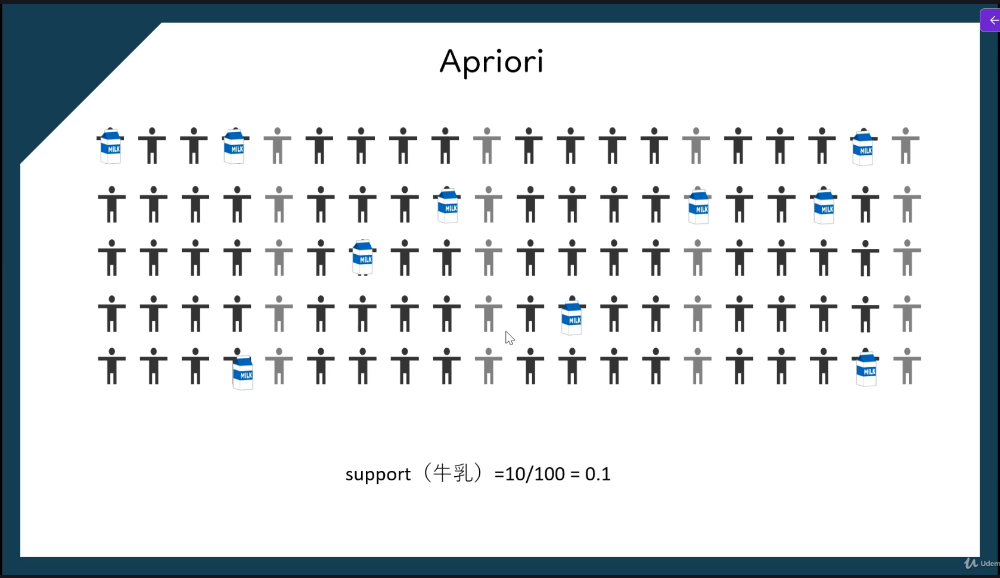
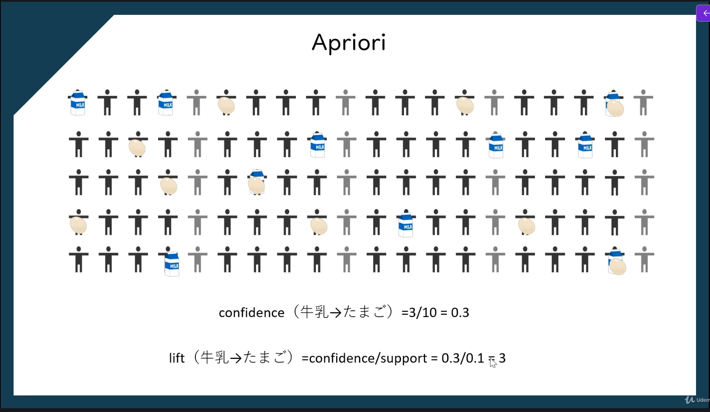

> **データの中から「一緒に起こりやすい事象の関係（ルール）」を発見するデータ分析手法**

特に **マーケットバスケット分析（Market Basket Analysis）**でよく使われる。

# Apriori

**相関ルール学習で「よく一緒に出現する商品（アイテム集合）」を見つけるためのアルゴリズム**。
特に **マーケットバスケット分析**で使われる。
簡単に言うと

> **頻繁に出現する商品の組み合わせ（頻出アイテム集合）を見つけるアルゴリズム**

## 指標

### 計算方法

$$support = \frac{牛乳を買った人の数}{すべてのデータ数}$$

$$confidence = \frac{たまごを勝った人の数}{牛乳を買った人の数}$$

$$lift = \frac{confideence}{support}$$
### support


### confidence・lift


## Aprioriの実装

```python

```