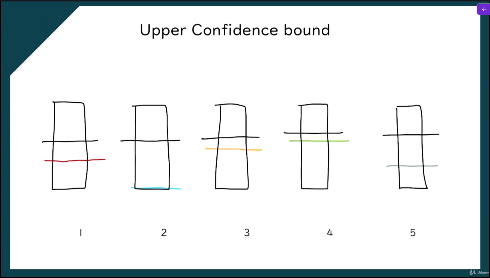
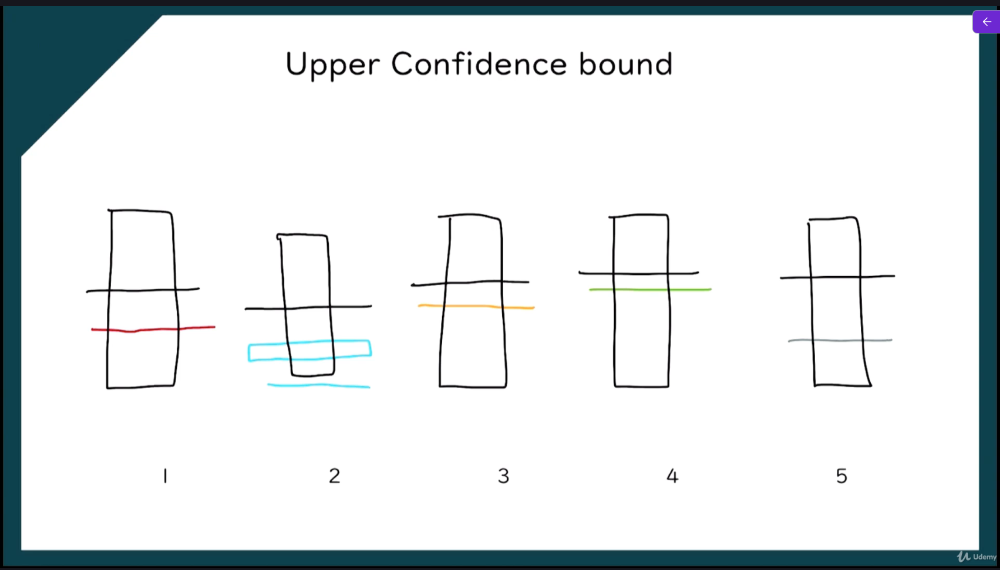
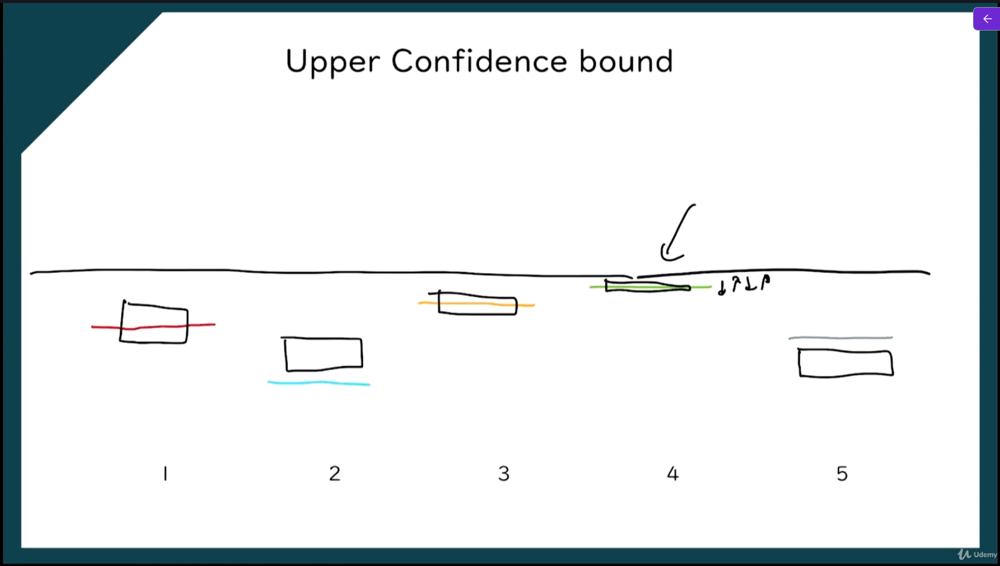
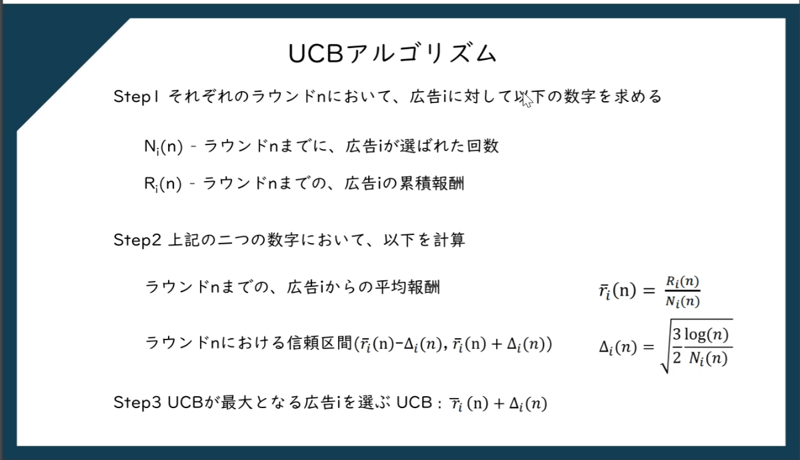
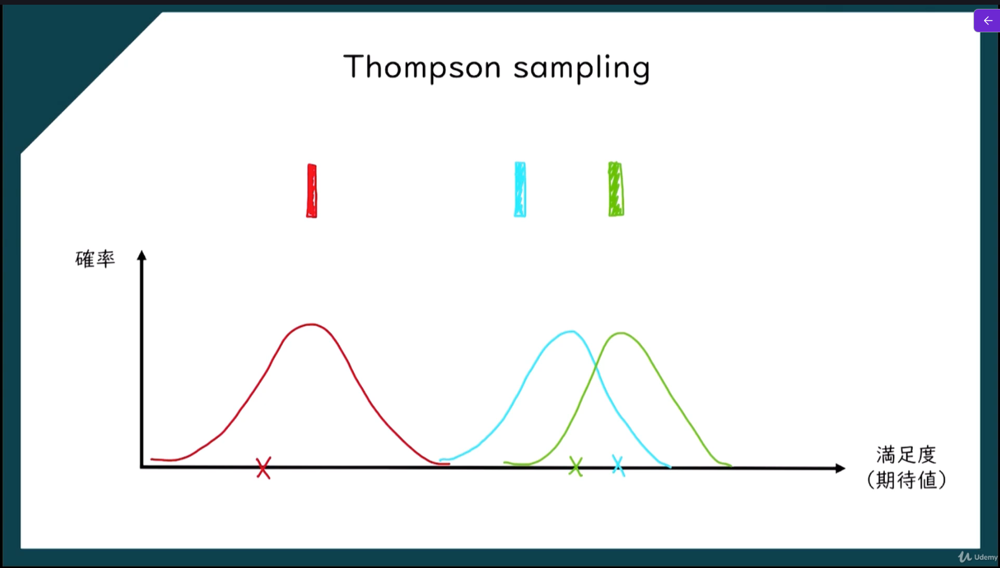

> **試行錯誤を通して、報酬（reward）を最大化する行動を学習する機械学習の方法**

簡単に言うと

> **「行動 → 結果 → 報酬」を繰り返しながら最適な行動を学ぶ**

仕組み。

強化学習は機械学習の一部ということができ、今の時刻をtとすると、t+1においてどういった行動をするべきかを決めるためのモデルとなる。
また、強化学習はAIの分野においても使われている。
モデルが意図した結果を出した場合はご褒美を与え、意図した結果を出さなかった場合は罰則を与えるという形で学習をさせる。

# Multi Armed Bandit（多腕バンディット）

- 活用：今知っている情報の中で一番いいものを選択する
- 探索：未学習データからランダムに選択する


# UpperConfidenceBound（UCB）

**化学習や多腕バンディット問題で「どの行動を選ぶか」を決めるための方法**。
目的は

> **探索（exploration）と活用（exploitation）のバランスを取ること**


※それぞれの色付き線は報酬の期待値
※黒い横線は確信度の期待値
※黒い四角は確信度の幅

1. 実際にスロットを動かした際に、得られた報酬（色付きの四角）に応じて確信度の期待値を変更する


2. 確信度の幅を狭める


3. 1～2を繰り返して、学習する


## UCBアルゴリズム



## Upper Confidence Boundの実装

```python
# Upper Confidence Bound
import numpy as np
import matplotlib.pyplot as plt
import pandas as pd
import math

# 分析前の前処理
dataset = pd.read_csv('data/Ads_CTR_Optimisation.csv') # データセットを読み込む

# UCBアルゴリズムの実装
N = 10000 # データの数
d = 10 # 広告の数
ads_selected = [] # 選択された広告の番号を格納するリストを定義
numbers_of_selections = [0] * d # 各広告が選択された回数を格納するリストを定義
sums_of_rewards = [0] * d # 各広告の報酬の合計を格納するリストを定義
total_reward = 0 # 総報酬を格納する変数を定義

# 
for n in range(0, N): # データの数だけループを実行
    max_upper_bound = 0 # 最大値を格納する変数を初期化
    ad = 0 # 選択された広告の番号を格納する変数を初期化
    
    for i in range(0, d): # 広告の数だけループを実行
        if (numbers_of_selections[i] > 0): # 広告iが少なくとも1回選択されている場合
            # 広告iが少なくとも1回選択されている場合、平均報酬と信頼区間の幅を計算して上限信頼区間を求める
            average_reward = sums_of_rewards[i] / numbers_of_selections[i] # 広告iの平均報酬を計算
            delta_i = math.sqrt(3/2 * math.log(n + 1) / numbers_of_selections[i]) # 広告iの信頼区間の幅を計算
            upper_bound = average_reward + delta_i # 広告iの上限信頼区間を計算
        else: # 広告iがまだ選択されていない場合
            upper_bound = 10000000 # 広告iの上限信頼区間を非常に大きな値に設定
        
        if upper_bound > max_upper_bound: # 広告iの上限信頼区間がこれまでの最大値より大きい場合
            # 広告iの上限信頼区間がこれまでの最大値より大きい場合、最大値を更新して広告iを選択する
            max_upper_bound = upper_bound # 最大値を更新
            ad = i # 広告iを選択
    
    ads_selected.append(ad) # 選択された広告の番号をリストに追加
    numbers_of_selections[ad] += 1 # 選択された広告の選択回数を更新
    reward = dataset.values[n, ad] # 選択された広告の報酬を取得
    sums_of_rewards[ad] += reward # 選択された広告の報酬の合計を更新
    total_reward += reward # 総報酬を更新

# 結果の表示
print('Total Reward:', total_reward) # 総報酬を表示
print('Ads Selected:', ads_selected) # 選択された広告を表示

# 選択された広告のヒストグラムを描画
plt.hist(ads_selected) # 選択された広告のヒストグラムを描画
plt.title('Histogram of ads selections') # グラフのタイトルを設定
plt.xlabel('Ads') # x軸のラベルを設定
plt.ylabel('Number of times each ad was selected') # y軸のラベルを設定
plt.xticks(range(d)) # x軸の目盛りを広告の番号に
plt.show() # グラフを表示
```


# Thompson Sampling

**多腕バンディット問題で「どの行動を選ぶか」を決める確率的アルゴリズム**。
目的は

> **探索（exploration）と活用（exploitation）のバランスをとりながら、最も報酬の高い行動を見つけること**

1. 期待値が一番大きい店を選択し、実際の満足度を確認する


