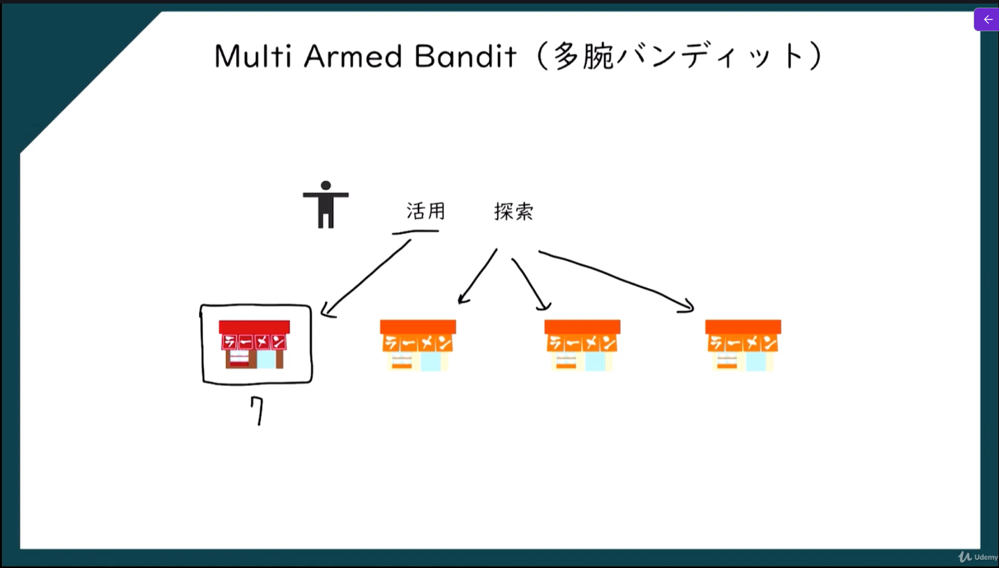

> **試行錯誤を通して、報酬（reward）を最大化する行動を学習する機械学習の方法**

簡単に言うと

> **「行動 → 結果 → 報酬」を繰り返しながら最適な行動を学ぶ**

仕組み。

強化学習は機械学習の一部ということができ、今の時刻をtとすると、t+1においてどういった行動をするべきかを決めるためのモデルとなる。
また、強化学習はAIの分野においても使われている。
モデルが意図した結果を出した場合はご褒美を与え、意図した結果を出さなかった場合は罰則を与えるという形で学習をさせる。

# Multi Armed Bandit（多腕バンディット）

- 活用：今知っている情報の中で一番いいものを選択する
- 探索：未学習データからランダムに選択する

# UpperConfidenceBound（UCB）

**化学習や多腕バンディット問題で「どの行動を選ぶか」を決めるための方法**。
目的は

> **探索（exploration）と活用（exploitation）のバランスを取ること**

