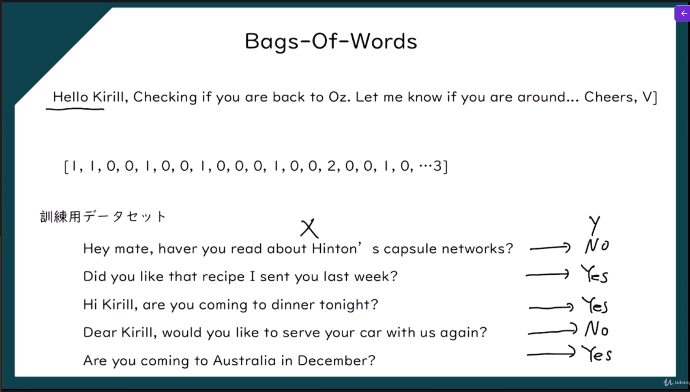
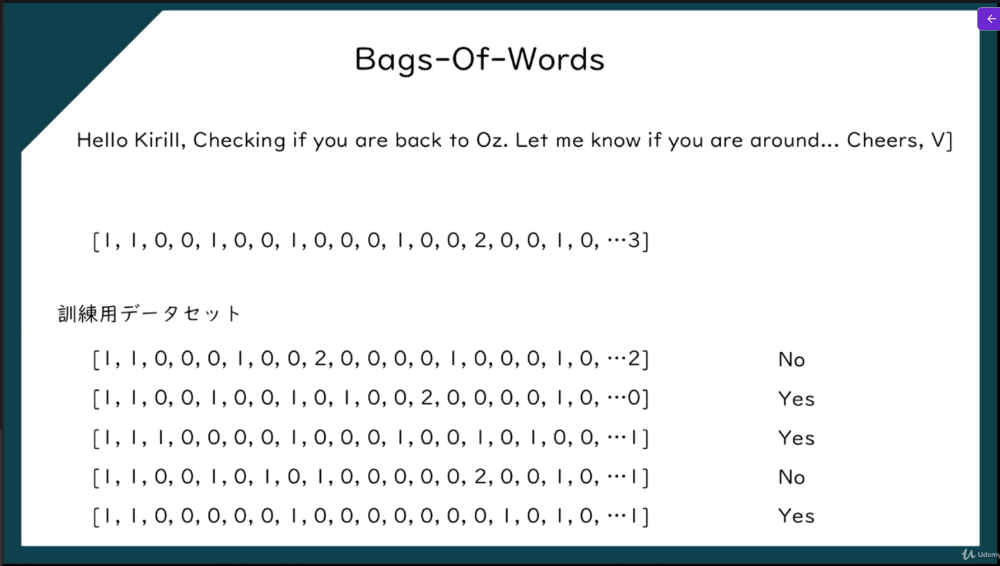

> **人間の言語（日本語・英語など）をコンピュータが理解・分析・生成できるようにする技術**

つまり

> **人間の言葉をコンピュータが扱えるようにするAI技術**

## 自然言語処理の種類


※NLP：Natural Language Processing
※DL：Deep Learning
※DNLP：Deep Natural Language Processing

## 自然言語処理の種類

### DL

1. Bags-of-words model（分類）
2. ニュートラルネットワーク
3. CNN
4. RNN/LSTM/GRU
5. Transformer
6. AutoEncoder
7. GAN

### NLP

1. If / Else Rules（Chatbot）
2. 音声認識
3. 形態素解析
4. 構文解析
5. 意味解析
6. ルールベース処理
7. 統計的手法
8. 機械学習
9. 深層学習

### Deep Natural Language Processing

1. CNN
2. Word2Vec
3. GloVe
4. RNN/LSTM
5. Seq2Seq
6. Attention
7. Transformer
8. BERT
9. GPT
10. T5

## Bags-Of-Words

文章を **「単語の集まり」** として表現する方法。  
大事なのは、**単語が何回出たか**を見る一方で、**単語の順番は無視する**ことです。scikit-learn でも、文書を数値ベクトル化する代表的な方法として説明されています。

文章を単語ごと（独立変数）に数字（ベクトル）に変換し結果を予測する


### 学習方法



※英文（独立変数）：単語のままでは学習できないため、ベクトル（数字）に変換して学習する
※回答予測（Yes/No）が従属変数

### ストップワード

文章を数値化するときに、**重要度が低いので除外される単語**のこと。

### Bags-Of-Wordsの実装

```python
# Natural Language Processing
import numpy as np
import matplotlib.pyplot as plt
import pandas as pd
import re
import nltk
from nltk.stem.porter import PorterStemmer
from sklearn.feature_extraction.text import CountVectorizer
from sklearn.model_selection import train_test_split
from sklearn.naive_bayes import GaussianNB
from sklearn.metrics import confusion_matrix, accuracy_score

# 分析前の前処理
#  delimiter='\t'は、タブ区切りのファイルを読み込むための引数。
#  quoting=3は、引用符を無視してデータを読み込むための引数。これにより、レビュー内のコンマやタブが正しく処理される。
dataset = pd.read_csv('data/Restaurant_Reviews.tsv', delimiter='\t', quoting=3) # データセットを読み込む

# テキストクリーニング（テキストの前処理）
nltk.download('stopwords') # ストップワードのリストをダウンロード
corpus = [] # クリーンなレビューを格納するリストを定義

# 1. レビューからアルファベット以外の文字を削除
# 2. レビューを小文字に変換
# 3. レビューを単語に分割
# 4. ストップワードを削除（ストップワード：文章を数値化するときに、重要度が低いので除外される単語のこと）
# 5. 単語をステミング（語幹化）する
for i in range(0, 1000): # データセットの数だけループを実行
    review = re.sub('[^a-zA-Z]', ' ', dataset['Review'][i]) # レビューからアルファベット以外の文字を削除
    review = review.lower() # レビューを小文字に変換
    review = review.split() # レビューを単語に分割
    ps = PorterStemmer() # ステミングのためのPorterStemmerオブジェクトを作成
    
    review = [ps.stem(word) for word in review if not word in set(nltk.corpus.stopwords.words('english'))] # ストップワードを削除し、単語をステミングする
    review = ' '.join(review) # 単語をスペースで結合して、クリーンなレビューを作成
    corpus.append(review) # クリーンなレビューをリストに追加

# Bag of Wordsモデルの作成
cv = CountVectorizer(max_features=1500) # 最大1500個の特徴量を保持する
X = cv.fit_transform(corpus).toarray() # レビューを数値化して、特徴量行列を作成
y = dataset.iloc[:, 1].values # レビューのラベル（肯定/否定）を取得

# 訓練用とテスト用のデータセットに分割
#  test_size=0.20は、データセットの20%をテスト用に使用することを指定する引数。
#  random_state=0は、データセットの分割を再現可能にするための引数。これにより、同じコードを実行するたびに同じ分割が得られる。
X_train, X_test, y_train, y_test = train_test_split(X, y, test_size=0.20, random_state=0) # データセットを訓練用とテスト用に分割

# ナイーブベイズアルゴリズムを使用して訓練用データの学習
classifier = GaussianNB() # ナイーブベイズ分類器を作成
classifier.fit(X_train, y_train) # 訓練用データを使用して分類器を学習

# テスト用データを使用して予測
y_pred = classifier.predict(X_test) # テスト用データを使用して予測

# 混同行列の作成
cm = confusion_matrix(y_test, y_pred) # 混同行列を作成
print(cm) # 混同行列を表示
print('Accuracy:', accuracy_score(y_test, y_pred)) # 正解率を計算して表示
```