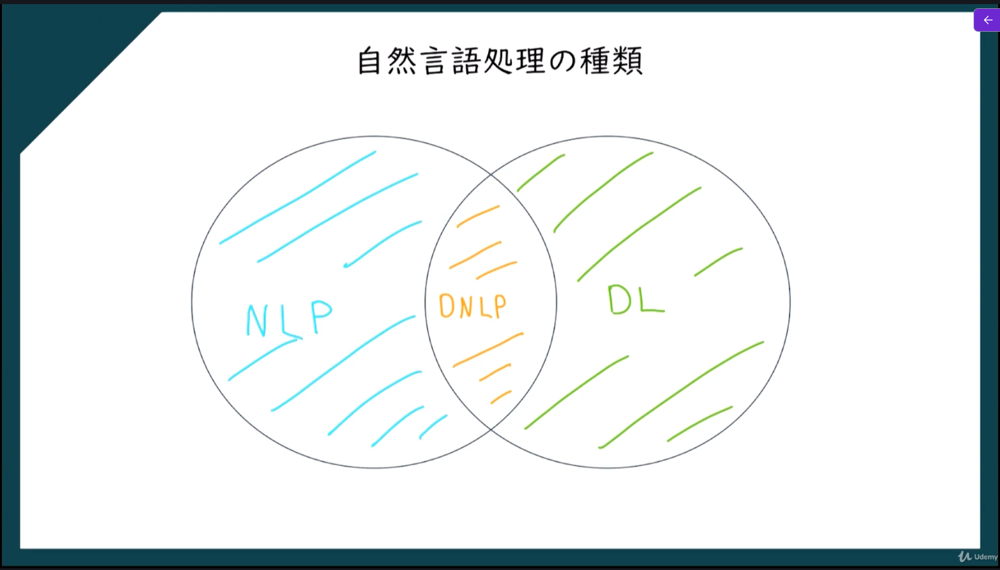
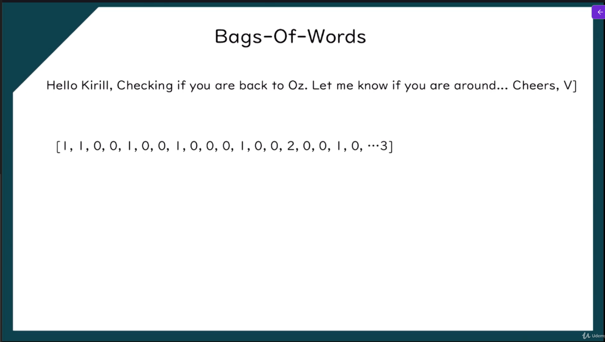

> **人間の言語（日本語・英語など）をコンピュータが理解・分析・生成できるようにする技術**

つまり

> **人間の言葉をコンピュータが扱えるようにするAI技術**

## 自然言語処理の種類

※NLP：Natural Language Processing
※DL：Deep Learning
※DNLP：Deep Natural Language Processing

## 自然言語処理の種類

### DL

1. Bags-of-words model（分類）
2. ニュートラルネットワーク
3. CNN
4. RNN/LSTM/GRU
5. Transformer
6. AutoEncoder
7. GAN

### NLP

1. If / Else Rules（Chatbot）
2. 音声認識
3. 形態素解析
4. 構文解析
5. 意味解析
6. ルールベース処理
7. 統計的手法
8. 機械学習
9. 深層学習

### Deep Natural Language Processing

1. CNN
2. Word2Vec
3. GloVe
4. RNN/LSTM
5. Seq2Seq
6. Attention
7. Transformer
8. BERT
9. GPT
10. T5

## Bags-Of-Words

文章を **「単語の集まり」** として表現する方法。  
大事なのは、**単語が何回出たか**を見る一方で、**単語の順番は無視する**ことです。scikit-learn でも、文書を数値ベクトル化する代表的な方法として説明されています。

1. 文章を単語ごとに数字に変換する

