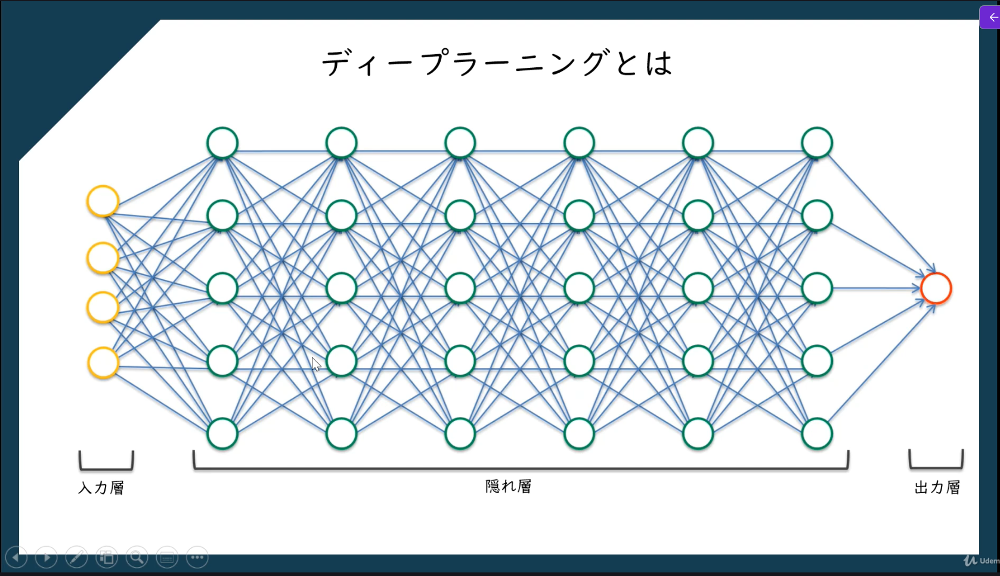
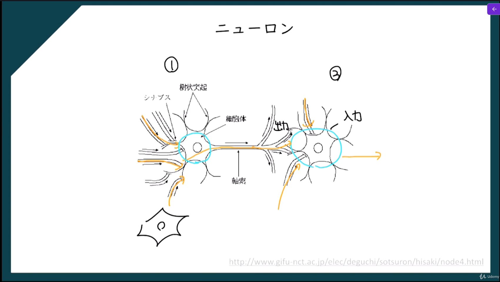
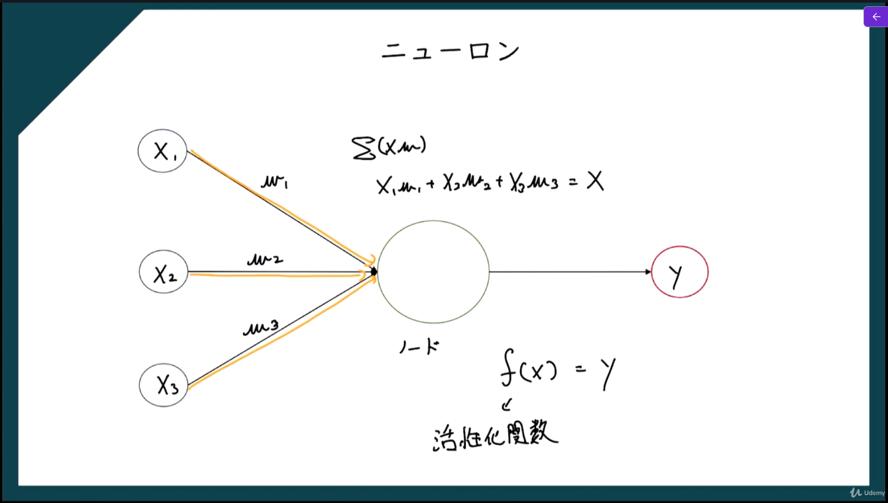
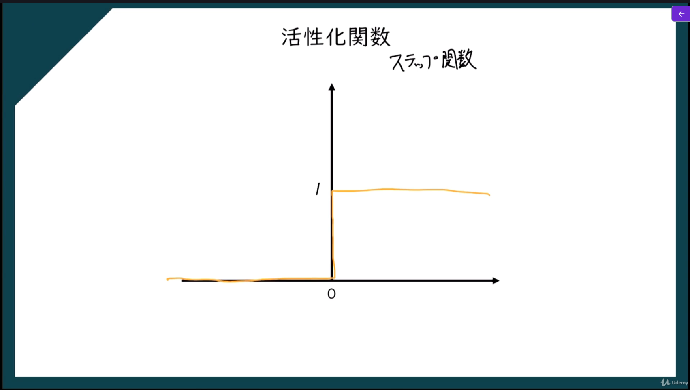
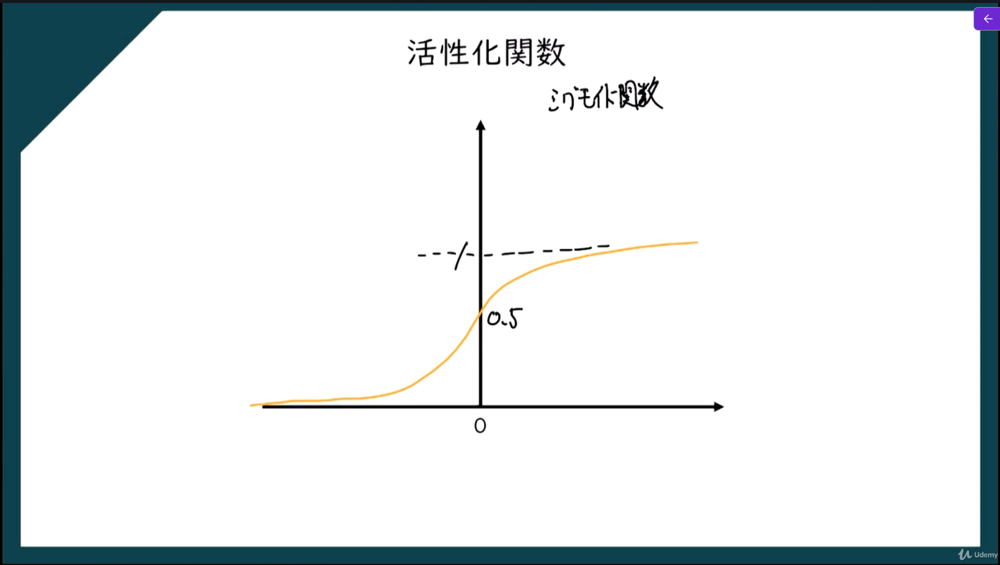
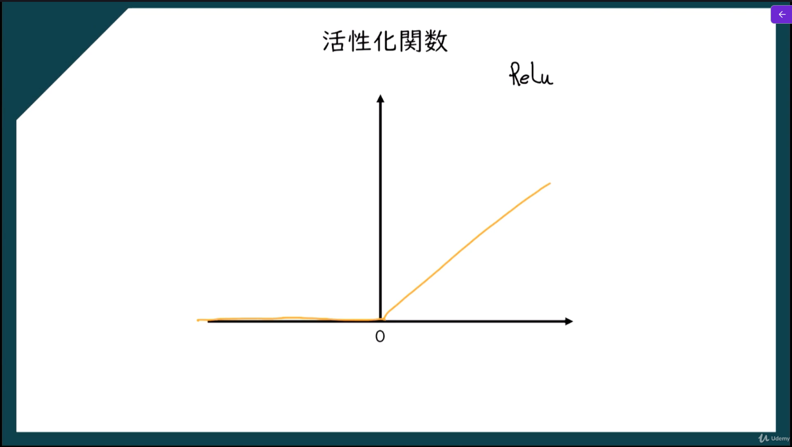
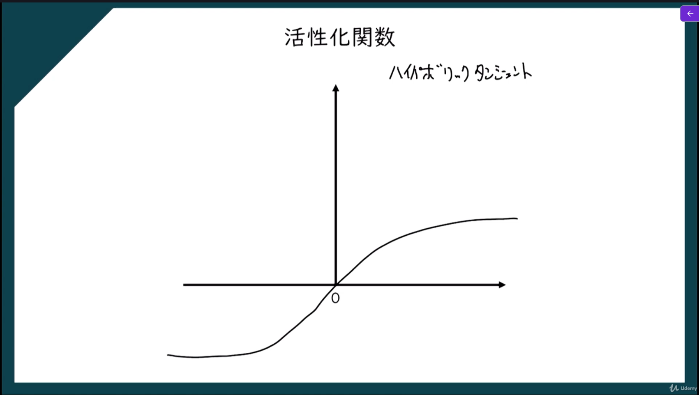
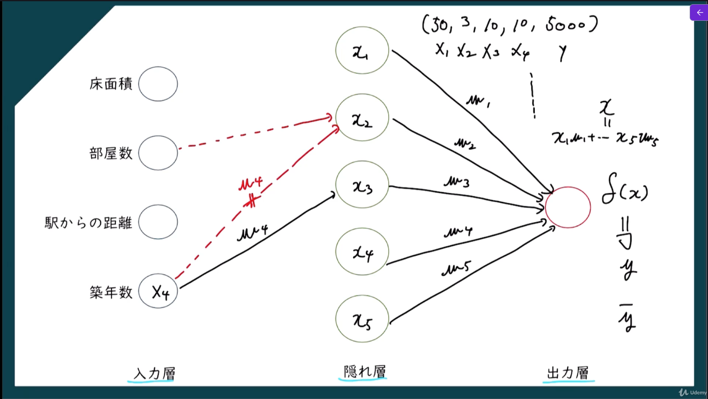
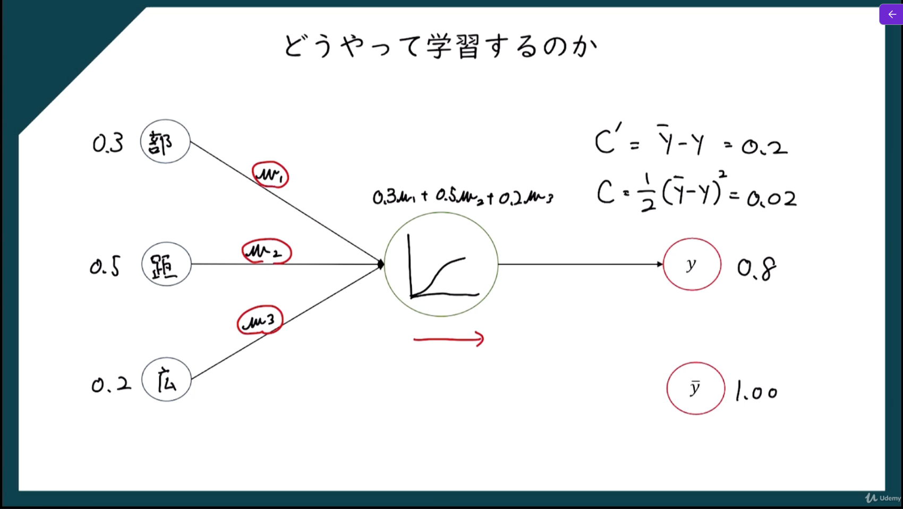
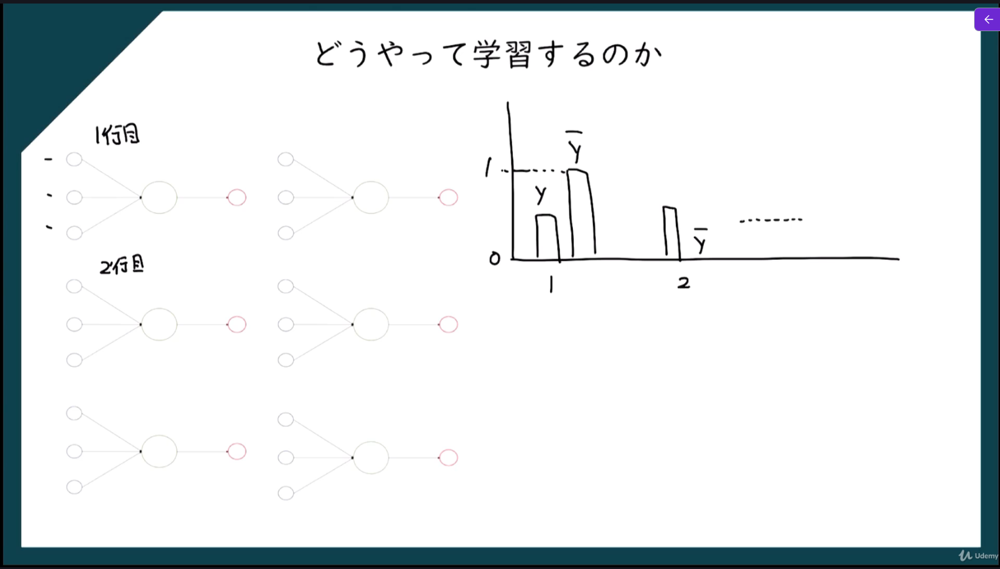

ディープラーニング（**Deep Learning**）とは、**人間の脳の神経回路をまねた「ニューラルネットワーク」を何層にも重ねて学習する技術**です。  
日本語では **深層学習** と呼ばれる。

# ニューラルネットワーク

ニューラルネットワークとは、**人間の脳の神経回路をまねして作られた計算モデル**です。  
入力されたデータから特徴を学び、**分類・予測・認識**などを行います。

## ニューロン

## 活性化関数

1. ステップ関数：入力値が1より小さければ0を返却し、1以上であれば1を返却する（入力データを2つに分けたいときに使う）

2. シグモイド関数：入力値が0に近いほど値が変化する

3. ReLu：入力値が0以上の場合のみ値が変化する（プラスの要素のみ出力する）

4. ハイパボリックタンジェント：入力値が0以下の場合、マイナスの値を出力する

## ニューラルネットワークの学習方法

入力層の情報を隠れ層に渡して活性化関数で重み付けした情報を次の層へ受け渡す。
これを繰り返し、最終的に出力層に情報を出力する。
※隠れ層は１つとは限らない

C（損失関数（Cost Function））の値が最小となるように学習を進める

※各入力数の横の数字は入力値を標準化した後の値
※yハット：入力値に対してニューラルネットワークが出力した値
※y：実際の値

実際のニューラルネットワークは上記が複数個出るため、すべての行の損失関数の値を足した値が最小となるように重みを調整して学習する。

## 勾配降下法

損失関数の値を最小にするための考え方

