ディープラーニング（**Deep Learning**）とは、**人間の脳の神経回路をまねた「ニューラルネットワーク」を何層にも重ねて学習する技術**です。  
日本語では **深層学習** と呼ばれる。


# ニューラルネットワーク（ANN）

ニューラルネットワークとは、**人間の脳の神経回路をまねして作られた計算モデル**です。  
入力されたデータから特徴を学び、**分類・予測・認識**などを行います。

## ニューロン


## 活性化関数

1. ステップ関数：入力値が1より小さければ0を返却し、1以上であれば1を返却する（入力データを2つに分けたいときに使う）


2. シグモイド関数：入力値が0に近いほど値が変化する


3. ReLu：入力値が0以上の場合のみ値が変化する（プラスの要素のみ出力する）


4. ハイパボリックタンジェント：入力値が0以下の場合、マイナスの値を出力する


## ニューラルネットワークの学習方法

入力層の情報を隠れ層に渡して活性化関数で重み付けした情報を次の層へ受け渡す。
これを繰り返し、最終的に出力層に情報を出力する。
※隠れ層は１つとは限らない


C（損失関数（Cost Function））の値が最小となるように学習を進める

※各入力数の横の数字は入力値を標準化した後の値
※yハット：入力値に対してニューラルネットワークが出力した値
※y：実際の値

実際のニューラルネットワークは上記が複数個出るため、すべての行の損失関数の値を足した値が最小となるように重みを調整して学習する。


## 勾配降下法

損失関数の値を最小にするための考え方

yハットの値をグラフの真ん中に近づけることで損失関数の値を0に近づけることができる。
そのため、yハットの値がグラフの真ん中に近づくように重み付けを調整することで学習を最適化できる
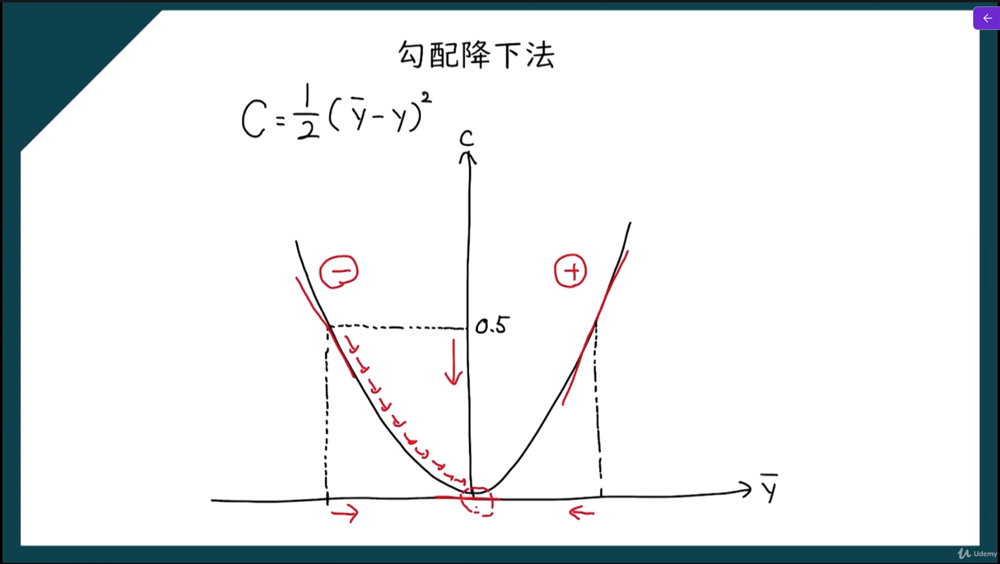

## 確率的勾配降下法

損失関数の値を最小にするための考え方
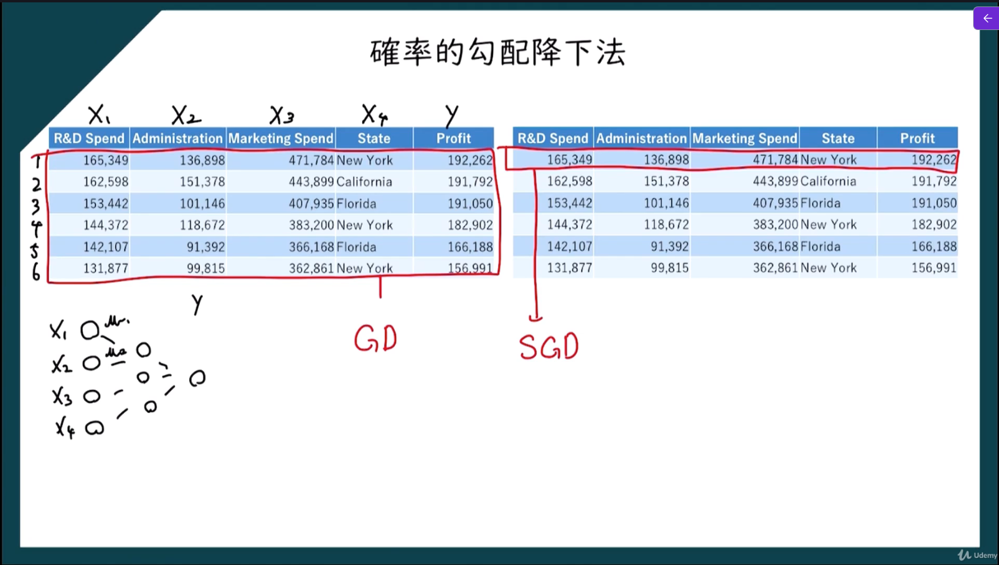

### 勾配降下法との違い

一番大きな違いは、**勾配を計算するときに使うデータ量**です。

##### 勾配降下法
- 全訓練データを使って勾配を計算
- 更新は安定しやすい
- ただし1回の更新に時間がかかる

##### 確率的勾配降下法
- 1件、または少数のデータで勾配を計算
- 更新は速い
- ただしばらつきがあり、ギザギザ進む

### なぜ確率的なのか

「確率的」と呼ばれるのは、  **どのデータを使って更新するかがランダムに選ばれることが多い**ため。

## 誤差逆伝搬法

**ニューラルネットワークで出力の誤差を各層へ後ろ向きに伝え、重みをどのように修正すればよいかを求める方法**。
ニューラルネットワークは、入力を受け取って計算し、最後に出力を出します。  
しかし最初は重みが適切でないので、正しい答えからずれることがあります。
そこで、
1. 出力と正解を比べて誤差を求める
2. その誤差が、どの重みのせいでどれだけ生じたかを調べる
3. 重みを少しずつ修正する

という流れで学習します。
この **「誤差を後ろから前へ伝えながら、各重みの修正量を求める」** のが誤差逆伝搬法です。

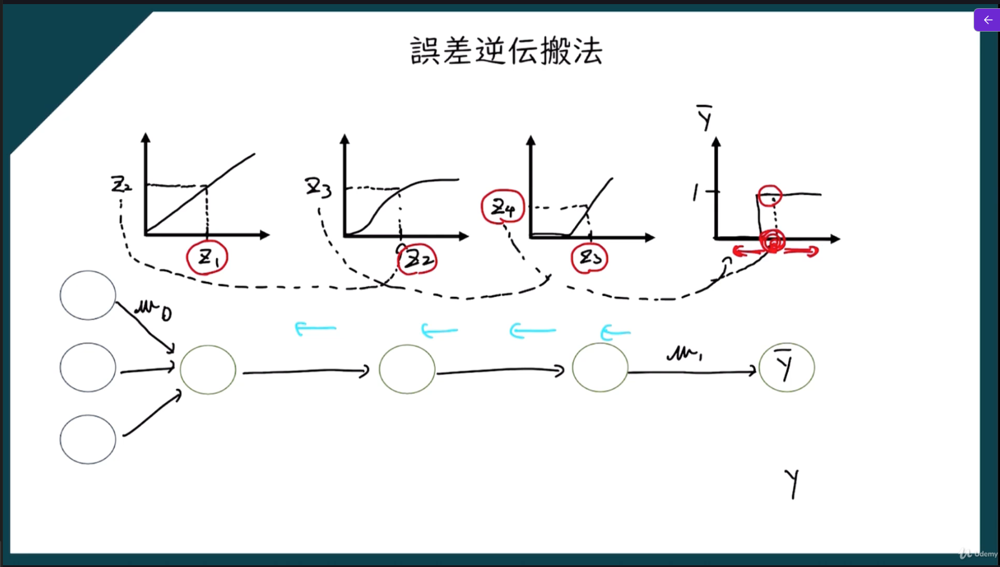

## ニュートラルネットワークの実装

```python
# ニューラルネットワーク
import numpy as np
import matplotlib.pyplot as plt
import pandas as pd
import tensorflow as tf
from sklearn.preprocessing import LabelEncoler
from sklearn.compose import ColumnTransformer
from sklearn.preprocessing import OneHotEncoder
from sklearn.preprocessing import StandardScaler
from sklearn.model_selection import train_test_split
from sklearn.metrics import confusion_matrix, accuracy_score

# 前処理
dataset = pd.read_csv('Churn_Modelling.csv')
X = dataset.iloc[:, 3:-1].values
y = dataset.iloc[:, -1].values

# カテゴリ変数のエンコード
# Gender列のエンコード
le = LabelEncoler()
X[:, 2] = le.fit_transform(X[:, 2])

# Geography列のエンコード
ct = ColumnTransformer(transformers=[('encoder', OneHotEncoder(), [1])], remainder='passthrough')
X = np.array(ct.fit_transform(X))

# フィーチャースケーリング
sc = StandardScaler()
X = sc.fit_transform(X)

# 訓練データとテストデータの分割
#  test_size=0.2は、データセットの20％をテストデータとして使用することを意味します。
#  random_state=0は、データの分割を再現可能にするための乱数シードを指定しています。これにより、同じコードを実行するたびに同じ分割が得られます。
X_train, X_test, y_train, y_test = train_test_split(X, y, test_size=0.2, random_state=0)

# ニューラルネットワークの構築
ann = tf.keras.models.Sequential()

# 入力層と最初の隠れ層の追加
#  units=6は、隠れ層のニューロンの数を指定しています。ここでは、6個のニューロンを使用しています。
#  activation='relu'は、活性化関数としてReLU（Rectified Linear Unit）を使用することを指定しています。ReLUは、非線形な関数であり、ニューラルネットワークの学習を効率的に行うために広く使用されています。
ann.add(tf.keras.layers.Dense(units=6, activation='relu'))

# 2番目の隠れ層の追加
ann.add(tf.keras.layers.Dense(units=6, activation='relu'))

# 出力層の追加
#  units=1は、出力層のニューロンの数を指定しています。ここでは、1個のニューロンを使用しています。これは、2クラス分類問題であるため、出力が0または1になることを意味します。
#  activation='sigmoid'は、活性化関数としてシグモイド関数を使用することを指定しています。シグモイド関数は、出力を0から1の範囲に変換するため、2クラス分類問題に適しています。
ann.add(tf.keras.layers.Dense(units=1, activation='sigmoid'))

# ニュートラルネットワークの学習
# ニュートラルネットワークのコンパイル
#  optimizer='adam'は、最適化アルゴリズムとしてAdamを使用することを指定しています。Adamは、効率的な学習を実現するための一般的な最適化アルゴリズムです。
#  loss='binary_crossentropy'は、損失関数としてバイナリクロスエントロピーを使用することを指定しています。これは、2クラス分類問題に適した損失関数です。
#  metrics=['accuracy']は、モデルの評価指標として精度を使用することを指定しています。これにより、モデルの性能を評価する際に精度が計算されます。
ann.compile(optimizer='adam', loss='binary_crossentropy', metrics=['accuracy'])

# ニュートラルネットワークの訓練（学習）
#  batch_size=32は、訓練データを32個のサンプルのバッチに分割してモデルを訓練することを指定しています。これにより、モデルの更新が効率的に行われます。
#  epochs=100は、訓練データセット全体を100回繰り返してモデルを訓練することを指定しています。これにより、モデルが十分に学習されることが期待されます。
ann.fit(X_train, y_train, batch_size=32, epochs=100)

# 結果の予測
y_pred = ann.predict(X_test)
py_pred = (y_pred > 0.5)
print(np.concatenate((y_pred.reshape(len(y_pred), 1), py_pred.reshape(len(py_pred), 1), y_test.reshape(len(y_test), 1)), 1))

# 混同行列の作成
cm = confusion_matrix(y_test, py_pred)
print(cm)
print(accuracy_score(y_test, py_pred))
```


# 畳み込みニュートラルネットワーク（CNN）
 
**主に画像データを効率よく処理するために作られたニューラルネットワーク**です。  
日本語では **畳み込み神経回路網** とも呼ばれます。
普通のニューラルネットワークでも画像を扱えますが、画像は
- 縦横の位置関係がある
- 近くの画素どうしに意味がある
- データ量がとても大きい

という特徴があります。
CNNは、こうした**画像の構造を活かして特徴を抽出する**のが得意です。
たとえば、
- 猫か犬かの判定
- 顔認識
- 手書き文字認識
- 医療画像診断
- 自動運転での物体認識

などに使われます。

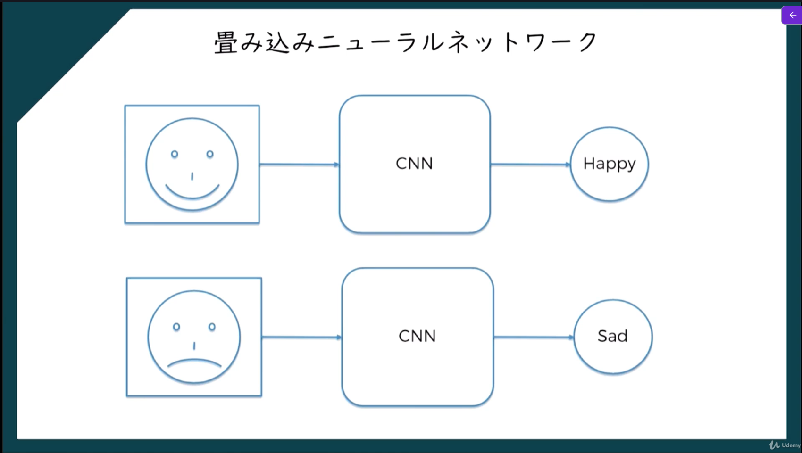

画像をピクセル単位に変換し、変換した結果を色（RGB）で分割した結果をさらに分析することで特徴を洗い出す。
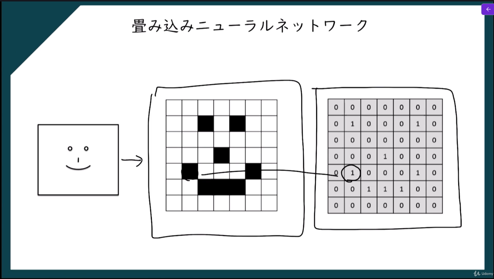

## なぜ「畳み込み」なのか

「畳み込み」とは、画像の一部分ずつを見ながら特徴を取り出す処理です。
たとえば画像全体を一度に見るのではなく、
- 小さな窓を当てる
- その部分の特徴を計算する
- 少しずつずらして全体を見る

というやり方をします。
この小さな窓のことを **フィルタ** または **カーネル** と呼びます。

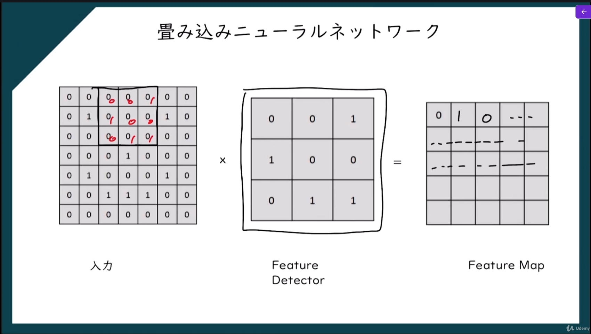

### フィルターの種類

1. Sharpen
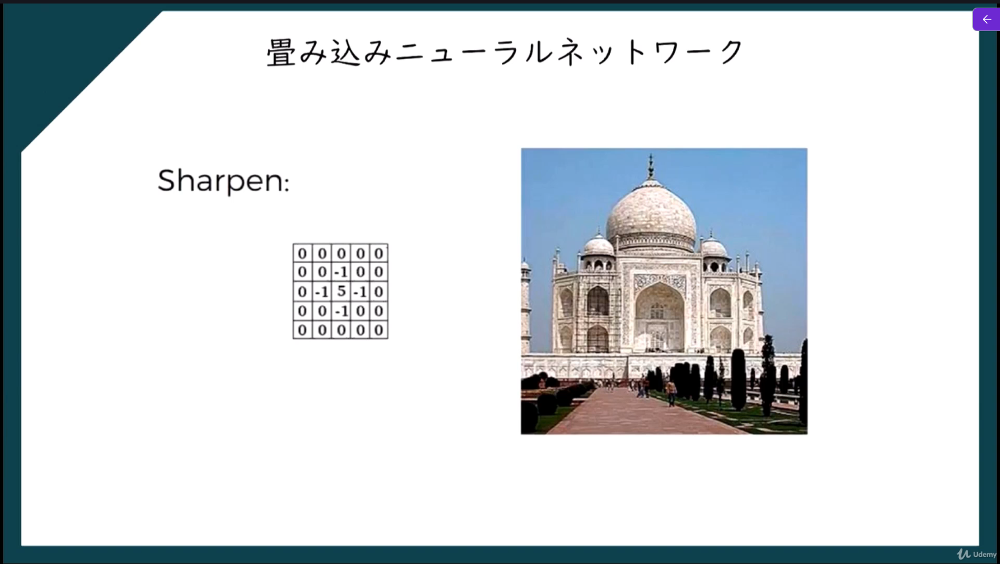

2. Blur
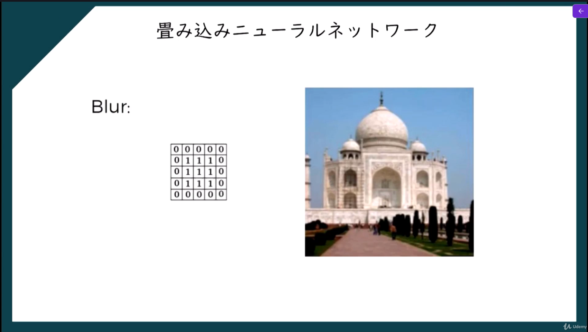

3. Edge Detect
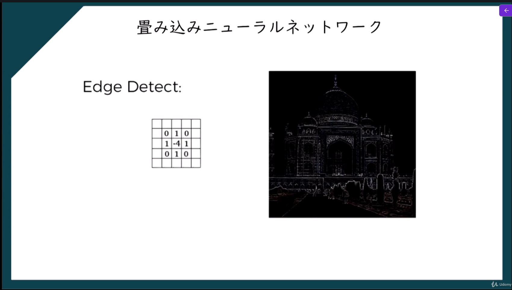

## プーリング層

畳み込み層では、画像から
- 線
- 輪郭
- 模様
- 特徴的な部分

などを取り出して、**特徴マップ**を作ります。

しかし、そのままだとデータ量が大きく、計算量も増えます。  
そこでプーリング層を使って、**特徴マップを縮小**します。
つまり、プーリング層は  **「重要な特徴を残しながら、情報を圧縮する層」**  と考えるとわかりやすいです。

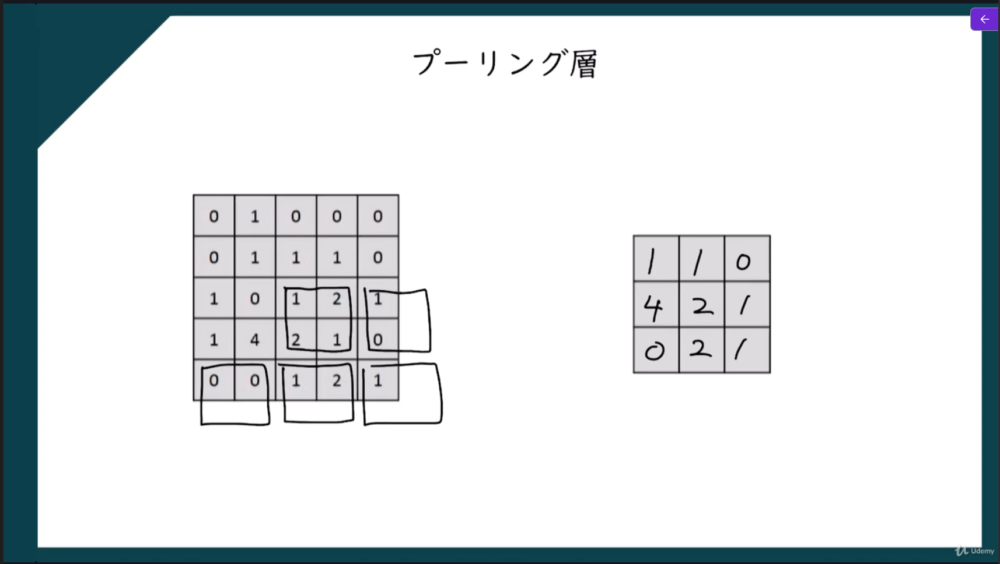

### どうやって縮小するのか

特徴マップの小さな範囲ごとに、代表値を取り出します。
たとえば 2×2 の領域ごとに1つの値にまとめる、というようなことをする。

### 代表値の取り出し方

1. Max Pooling：指定範囲内から最大値を取り出す
2. Average Pooling：指定範囲の平均値を取り出す

## Flattening

畳み込み層やプーリング層を通した後のデータは、普通
- 縦
- 横
- チャンネル数
を持つ**多次元データ**になっています。
たとえば、ある層の出力が
- 4 × 4 × 3
だったとします。  
これはそのままだと全結合層に入れにくいため、  **1本のベクトルに並べ直す**必要があります。
この処理が Flattening です。

たとえば 2 × 2 のデータが
```
1 2  
3 4
```
なら、Flattening すると
```
[1, 2, 3, 4]
```
のような1次元データになります。
さらに 3次元データでも、  要素を順番に並べて1列にします。

## CNNの流れ

CNNでは一般的に次の流れになります。
```
入力画像  
↓  
畳み込み層  
↓  
プーリング層  
↓  
Flattening  
↓  
全結合層  
↓  
出力
```

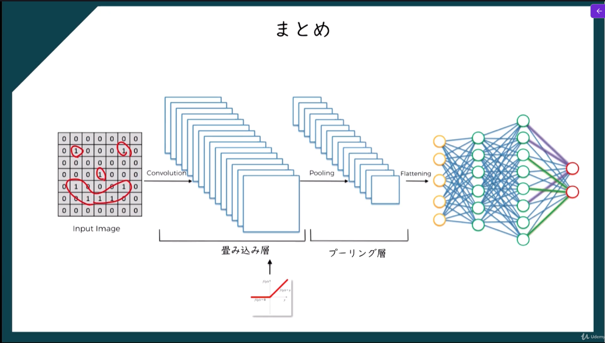

## softmax関数

softmax関数とは、**複数の値を「合計が1になる確率の形」に変換する関数**です。  
主に、**多クラス分類**の出力層で使われます。
たとえば、
- 猫
- 犬
- 鳥

の3種類を分類するモデルなら、  最終的に「それぞれのクラスである確率らしさ」を出すために softmax 関数が使われます。

たとえば出力が
- 猫: 2.0
- 犬: 1.0
- 鳥: 0.1
だったとします。
このままでは、
- 合計が1ではない
- 確率として解釈しにくい
という問題があります。
そこで softmax 関数を使うと、これらを
- 猫: 0.66
- 犬: 0.24
- 鳥: 0.10
のように、**合計1の値**に変換できます。

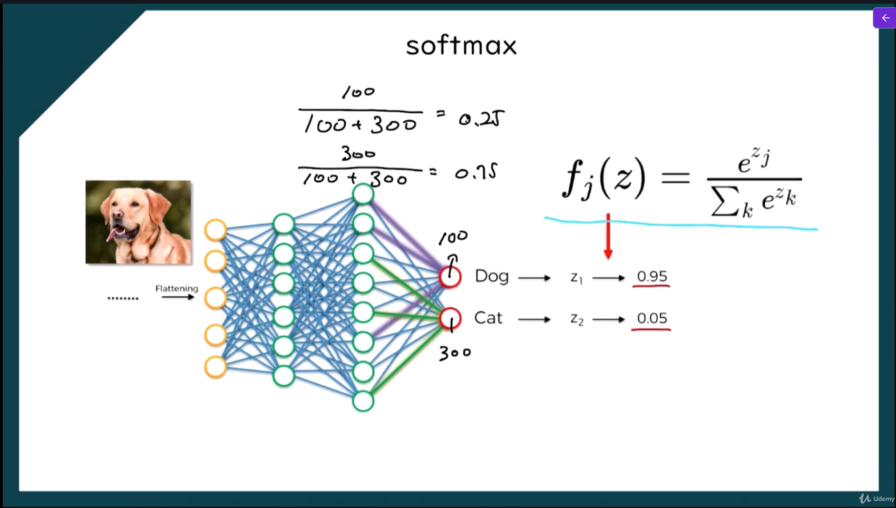

### 数式

$$softmax(xi) = \frac{e^xi}{\sum_{j=1}^n e^xj}$$

## cross entropy関数

ニューラルネットワークで分類をするとき、モデルは各クラスに対して確率を出します。
たとえば「猫・犬・鳥」の3クラス分類で、正解が「猫」だったとします。
モデルの予測が
- 猫: 0.8
- 犬: 0.1
- 鳥: 0.1
なら、かなり正解に近いです。
一方で
- 猫: 0.2
- 犬: 0.5
- 鳥: 0.3
なら、正解の「猫」に低い確率しか与えていないので、よくありません。
cross entropy は、この**正解にどれだけ高い確率を与えられたか**をもとに、予測の悪さを数値化します。

### 数式

$$L = - \sum_{i=1}^n yi log(Pi)$$


## 畳み込みニュートラルネットワークの実装

